# Simple Helm Installation of a Blazor project

- Create the Blazor project
- Create a docker file and build the project with a tag.
- Create a docker hub repository
- Build the docker using the docker hub repo name as tag with v1
- Push the docker image to docker hub

### Helm Chart creation.
- Create a helm chart using `helm create <chart-name>`
- Edit the `Chart.yaml` file to add the details of the chart.
- Edit the `values.yaml` file to add the details of the image and other configurations.
- Edit the `deployment.yaml` file to add the environment variable and other configurations.
- Install the helm chart using `helm install <release-name> <chart-name>`
- Check the deployment using `kubectl get deployments`
- Check the pods using `kubectl get pods`


```bash
# before installing the Helm, check in kubernetes for any deployment
kubectl get deployments
# check any pods
kubectl get pods
# Install the Helm chart
helm install simple-helm-app simple-helm-app/

# if you are already in the simple-helm-app folder install using
helm install simple-helm-app .

```
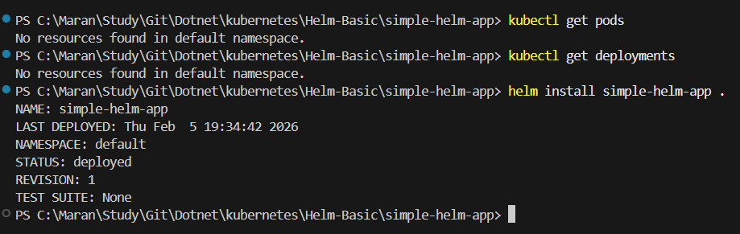

```bash
# List the installed Helm 
helm list

```
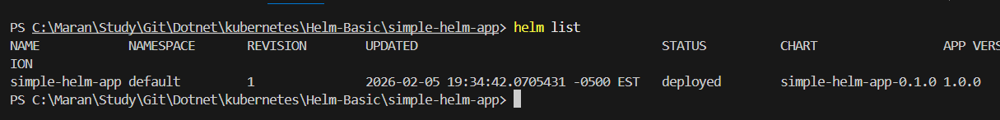

- Now check in kubernetes

```bash
# check the pods and deployment
kubectl get deployments
kubectl get pods

# check the Helm history
helm history simple-helm-app
```
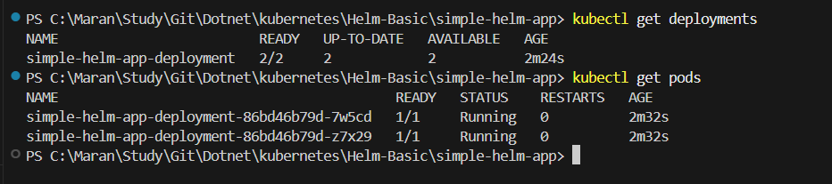

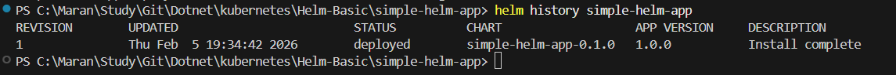

### Updating the Helm Chart
- Now update the replicas to 3 in `values.yaml` file.
```yaml
replicaCount: 3
image:
  repository: rmanimaran/helmapp
  tag: v1
service:
  port: 5000
environment: development
```
- Now upgrade the helm chart using `helm upgrade <release-name> <chart-name>`
```bash
# upgrade the helm
helm upgrade simple-helm-app .
```
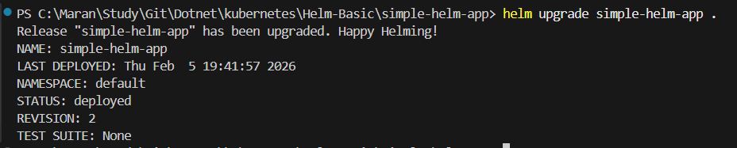
- Now check in kubernetes again
```bash
# check the pods and deployment
kubectl get deployments
kubectl get pods
```


- Now check the Helm history
```bash
helm history simple-helm-app
```
- The previous version will be set to status as superseded.

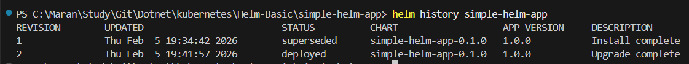

## Create a Service to expose to outside
1. Create a file named service.yml in the templates folder.
```yaml
apiVersion: v1
kind: Service
metadata:
  name: {{ .Release.Name }}-service
spec:
  type: {{ .Values.service.type | default "ClusterIP" }}
  selector:
    app: {{ .Release.Name }}
  ports:
    - port: {{ .Values.service.port }}
      targetPort: {{ .Values.container.targetPort }}
      nodePort: {{ .Values.service.nodePort | default 30000 }}
```
2. Update the values.yaml file
```yaml
replicaCount: 3
image:
  repository: rmanimaran/helmapp
  tag: v1
container:
  port: 5000

service:
  port: 80
  targetPort: 5000
  nodePort: 30000
  type: NodePort

environment: development
```
3. Now upgrade the helm chart again
```bash
# upgrade the helm chart
helm upgrade simple-helm-app .
```
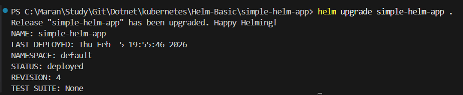

```bash
# check the service created
kubectl get services 
or
kubectl get svc
```
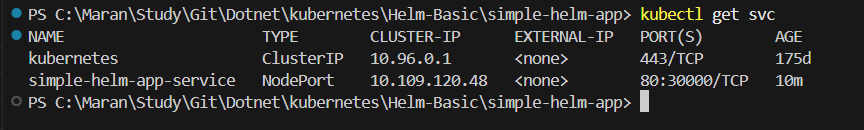

- Perform the port forward.
```bash
# port forward
kubectl port-forward service/simple-helm-app-service 8082:80
```

- Now access the application in the browser using `http://localhost:8082`


### Updating the Application
- Added the application with the updated converter
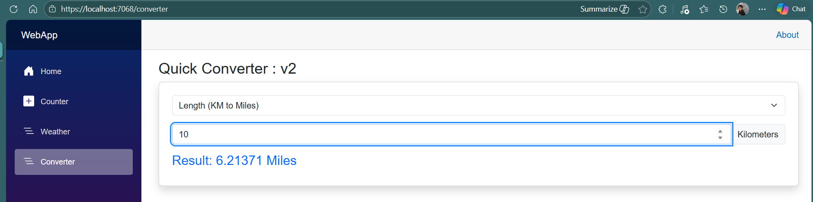
- Now Update the project and push the new version to docker hub
```bash
# build the docker with new tag v2
docker build -t rmanimaran/helmapp:v2 .
# push the docker to docker hub
docker push rmanimaran/helmapp:v2
```
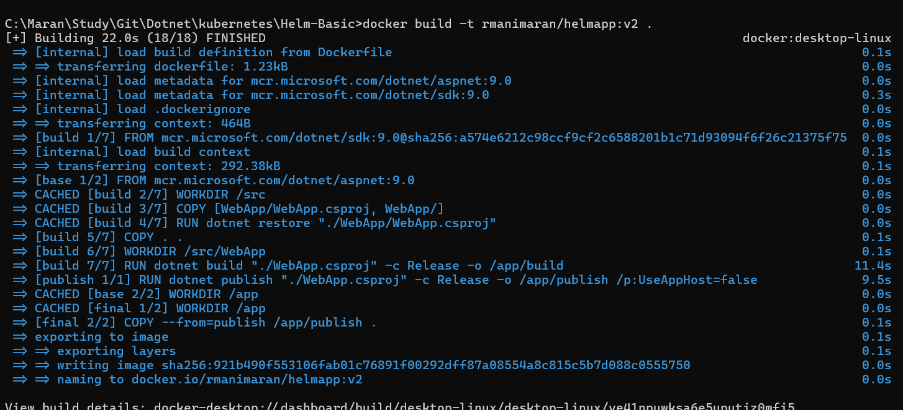
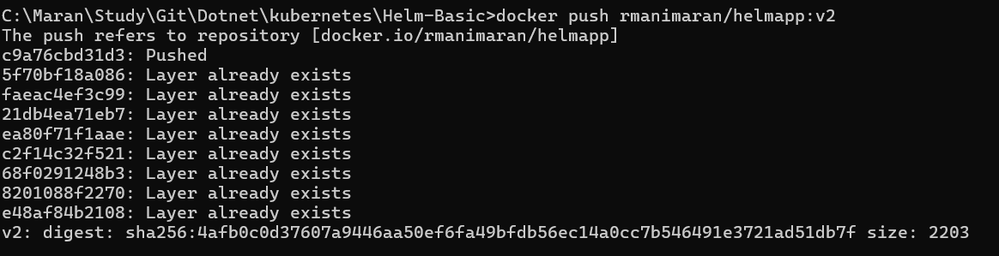

- Now I have v2 of our project pushed to docker hub.
- Now update the values.yaml file to use the new tag v2
```yaml
replicaCount: 3
image:
  repository: rmanimaran/helmapp
  tag: v2
container:
  port: 8080

service:
  port: 80
  nodePort: 30000
  type: NodePort

environment: development
```
- Now upgrade the helm chart again
```bash
# upgrade the helm chart
helm upgrade simple-helm-app .
```
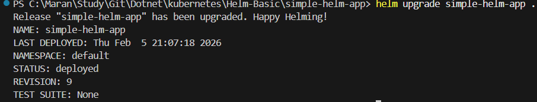

- get the Helm history
```bash
helm history simple-helm-app
```
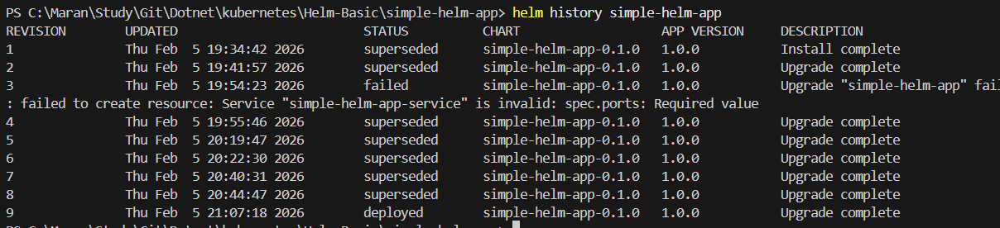
- Perform the port forward from the service
```bash
kubectl port-forward service/simple-helm-app-service 8082:80
```
- Now access the application in the browser using `http://localhost:8082`
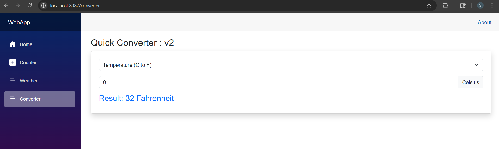
## Rollback testing
- Change the values files with the image version which does not exists
- Apply the Helm upgrade with the wrong version number
```yaml
replicaCount: 3
image:
  repository: rmanimaran/helmapp
  tag: v3.0.0
container:
  port: 8080

service:
  port: 80
  nodePort: 30000
  type: NodePort

environment: development
```
- Now upgrade the helm chart again
```bash
# upgrade the helm chart
helm upgrade simple-helm-app .
```
-Now the new version will be applied. But because of image tag v3.0.0 which is not exists, our application will shows error.
- Perform the rollback to version 8
```bash
helm rollback simple-helm-app 8
```
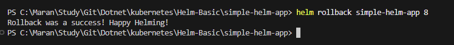

- Now port forward the application and test

- Rollback to version 1 of the application


- Rollback to v2 of the application
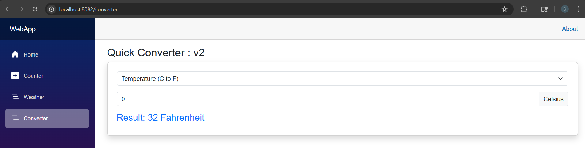

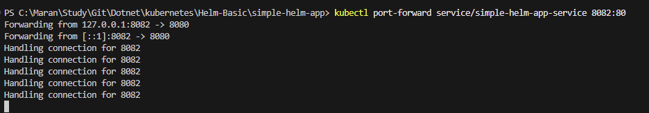

## Uninstall and Clean-up
- Now uninstall the helm release
```bash
helm uninstall simple-helm-app
```
- Verify its get removed.
```bash
helm list
kubectl get deployments
kubectl get pods
kubectl get services
```
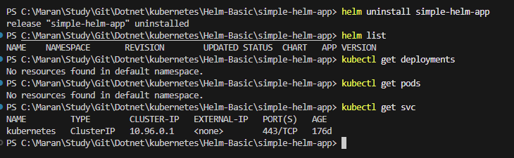


## Phase 2:
- Introduced Config file with template.
- Updated the Home.razor to show the Environment Information.
- pushed the version 3 of the Image to docker hub
- Updated the deployment.yaml with if else condition and created a separate value files for Staging, Development and production.

```bash
# helm install with values-dev.yaml
helm install simple-helm-app . -f values-dev.yaml
```
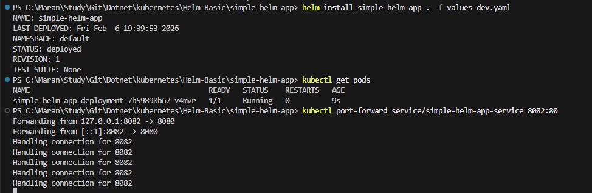

- Access the application and check the UI.
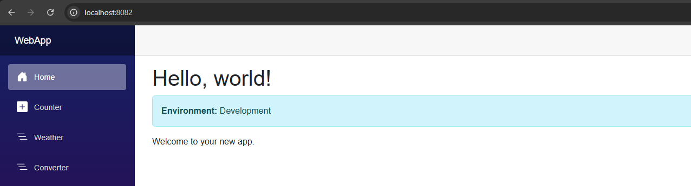

```bash
# helm uninstall and install as staging
helm uninstall simple-helm-app
helm install simple-helm-app . -f values-staging.yaml
# check the Pods and perform Port forward
kubectl get pods
kubectl port-forward service/simple-helm-app-service 8082:80
```


- Access the application and check for the environment information.
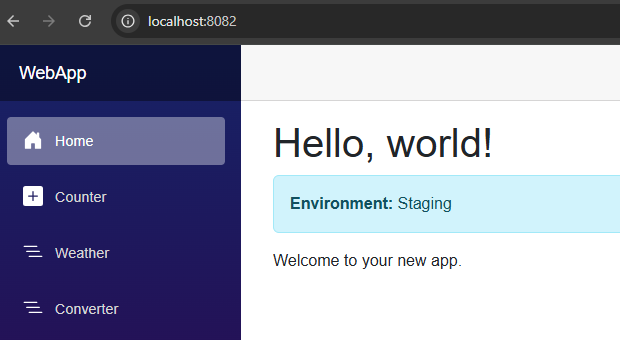

```bash
# helm uninstall and install as production
helm uninstall simple-helm-app
helm install simple-helm-app . -f values-prod.yaml
# check the Pods and perform Port forward
kubectl get pods
kubectl port-forward service/simple-helm-app-service 8082:80
```

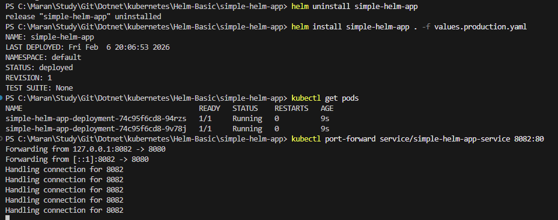

- Access the application and check for the environment information.
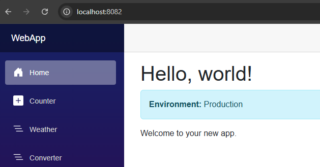