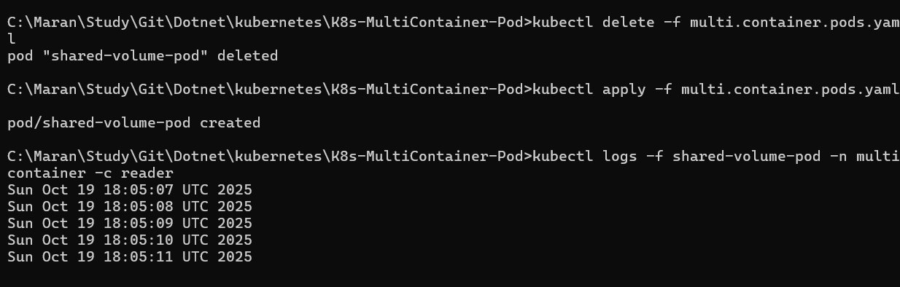

# Kubernetes Multi-Container Pod Demo

This project demonstrates inter-container communication in Kubernetes using shared volumes. It contains a pod with two containers:
- **Writer Container**: Continuously writes timestamps to a shared file
- **Reader Container**: Reads and displays the shared file content in real-time

## Prerequisites
- Kubernetes cluster (local or remote)
- kubectl configured and connected to your cluster

## Quick Start

### 1. Create Namespace and Deploy
```bash
# Create the namespace
kubectl create namespace multicontainer

# Apply the pod configuration
kubectl apply -f multi.container.pods.yaml
```

### 2. Verify Pod Status
```bash
# Check if pod is running
kubectl get pods -n multicontainer

# Get detailed pod information
kubectl describe pod shared-volume-pod -n multicontainer
```

### 3. Test Container Communication
```bash
# View logs from the reader container (should show timestamps)
kubectl logs shared-volume-pod -n multicontainer -c reader

# View logs from the writer container (should be empty since it writes to file)
kubectl logs shared-volume-pod -n multicontainer -c writer

# Follow live logs from reader to see real-time updates
kubectl logs -f shared-volume-pod -n multicontainer -c reader
```


### 4. Verify Shared Volume
```bash
# Execute into writer container and check the file
kubectl exec -it shared-volume-pod -n multicontainer -c writer -- cat /mnt/shared/volume.txt

# Execute into reader container and verify same file exists
kubectl exec -it shared-volume-pod -n multicontainer -c reader -- ls -la /mnt/shared/
```

### 5. Cleanup
```bash
# Delete the pod
kubectl delete pod shared-volume-pod -n multicontainer

# Delete the namespace
kubectl delete namespace multicontainer
```

## Expected Results
- The reader container logs should show continuously updating timestamps
- Both containers can access the same shared file at `/mnt/shared/volume.txt`
- This proves successful inter-container communication through shared storage

## Troubleshooting
- If you see only one timestamp, ensure the YAML uses `>>` (append) instead of `>` (overwrite)
- Check pod status with `kubectl get pods -n multicontainer` if containers aren't starting