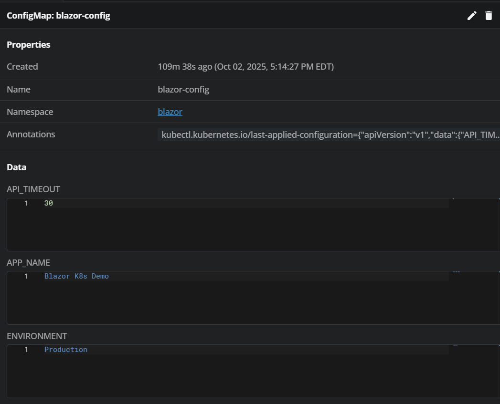
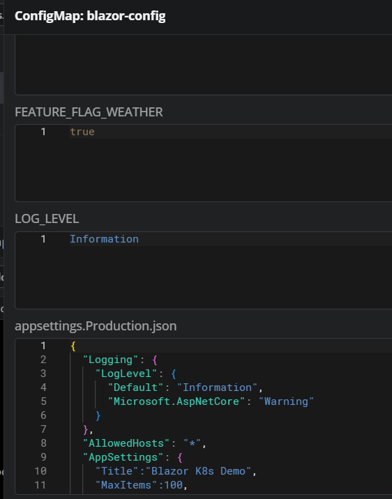
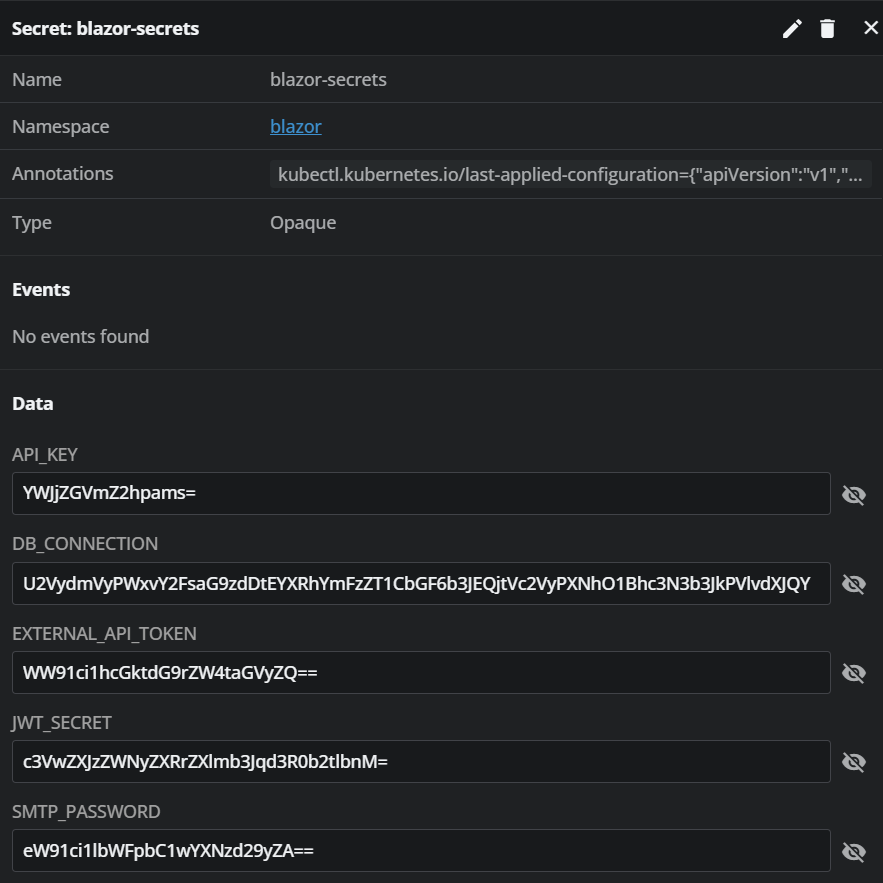
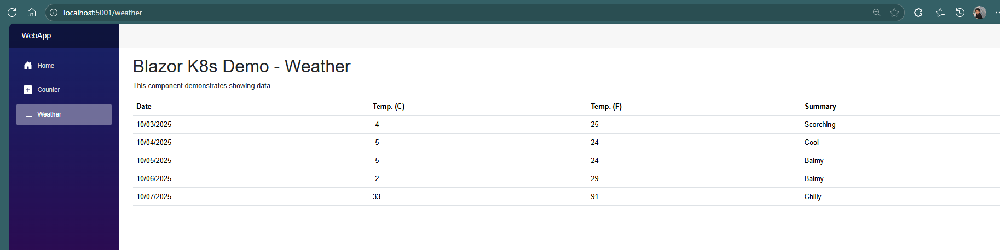

# Kubernetes ConfigMaps and Secrets with Blazor App

This project demonstrates how to use **Kubernetes ConfigMaps** and **Secrets** with a .NET 9 Blazor Server application. Perfect for learning how to manage configuration and sensitive data in Kubernetes.

## 📋 What You'll Learn

- **ConfigMaps**: Store non-sensitive configuration data
- **Secrets**: Store sensitive information like passwords and API keys
- **Environment Variables**: Inject config into containers
- **File Mounting**: Mount configuration files into containers
- **Mixed Configuration**: Combine ConfigMaps, Secrets, and file-based config

## 🏗️ Project Structure

```
K8s.ConfigAndSecrets/
├── WebApp/                    # Blazor Server Application
│   ├── Components/Pages/      # Razor pages (Home, Counter, Weather)
│   ├── Program.cs            # App configuration & startup
│   ├── AppSettings.cs        # Configuration model
│   └── appsettings.json      # Default app settings
├── K8s/                      # Kubernetes manifests
│   ├── namespace.yaml        # Creates 'blazor' namespace
│   ├── configmap.yaml        # Non-sensitive configuration
│   ├── secrets.yaml          # Sensitive data (passwords, keys)
│   ├── service.yaml          # Exposes the app
│   └── deployment.yaml       # Runs the app containers
├── Dockerfile               # Container image definition
└── README.md               # This file
```

## 🚀 Quick Start

### Prerequisites
- Docker Desktop with Kubernetes enabled
- kubectl configured
- .NET 9 SDK (for local development)

### Step 1: Build and Push Docker Image

```bash
# Build the Docker image
docker build -t blazorapp:latest .

# Tag for your registry (replace <dockerhub> with your username)
docker build -t <dockerhub>/blazorapp:latest .

# Push to registry
docker push <dockerhub>/blazorapp:latest
```

### Step 2: Deploy to Kubernetes

```bash
# Apply all Kubernetes manifests in order
kubectl apply -f K8s/namespace.yaml
kubectl apply -f K8s/configmap.yaml
kubectl apply -f K8s/secrets.yaml
kubectl apply -f K8s/service.yaml
kubectl apply -f K8s/deployment.yaml
```

### Step 3: Access the Application

```bash
# Option 1: Port forward (for testing)
kubectl port-forward svc/blazor-app -n blazor 8080:80
# Then open: http://localhost:8080
```

```bash
# Option 2: Get LoadBalancer IP (if supported)
kubectl get svc blazor-app -n blazor
# Access via: http://EXTERNAL-IP
```

## 📊 Configuration Examples

### ConfigMap (Non-Sensitive Data)
```yaml
# K8s/configmap.yaml
data:
  APP_NAME: "Blazor K8s Demo"
  ENVIRONMENT: "Production"
  FEATURE_FLAG_WEATHER: "true"
  API_TIMEOUT: "30"
  # File-based configuration
  appsettings.Production.json: |
    {
      "AppSettings": {
        "Title": "Blazor K8s Demo",
        "MaxItems": 100,
        "EnableWeatherFeature": true
      }
    }
```

### Secrets (Sensitive Data)
```yaml
# K8s/secrets.yaml
data:
  # Base64 encoded values
  DB_CONNECTION: <base64-encoded-connection-string>
  API_KEY: <base64-encoded-api-key>
stringData:
  # Plain text (auto-encoded by K8s)
  SMTP_PASSWORD: "your-password"
```

### How It's Used in the App
```csharp
// Program.cs - Loading configuration
builder.Configuration.AddJsonFile("/app/config/appsettings.Production.json", optional: true);
builder.Services.Configure<AppSettings>(builder.Configuration.GetSection("AppSettings"));

// Weather.razor - Using environment variables
var timeout = Environment.GetEnvironmentVariable("API_TIMEOUT");
var hasDbConnection = !string.IsNullOrEmpty(Environment.GetEnvironmentVariable("DB_CONNECTION"));
```

## 🔍 Verification Commands

### Check Deployment Status
```bash
# View all resources in the namespace
kubectl get all -n blazor

# Check pod logs
kubectl logs deployment/blazor-app -n blazor

# Check pod details
kubectl describe pod -l app=blazor-app -n blazor
```

### Verify Environment Variables
```bash
# Get pod name first
kubectl get pods -n blazor -l app=blazor-app

# List all environment variables
kubectl exec -it deployment/blazor-app -n blazor -- env

# Or using pod name directly
kubectl exec -it <pod-name> -n blazor -- env

# Check what files are actually mounted
kubectl exec -it deployment/blazor-app -n blazor -- ls -la /app/config/
```

### Filter Specific Variables
```bash
# Show only your custom variables
kubectl exec -it deployment/blazor-app -n blazor -- env | grep -E "(APP_NAME|ENVIRONMENT|LOG_LEVEL|FEATURE_FLAG_WEATHER|API_TIMEOUT|DB_CONNECTION|ASPNETCORE_ENVIRONMENT)"

# Show ConfigMap variables
kubectl exec -it deployment/blazor-app -n blazor -- env | grep -E "(APP_NAME|ENVIRONMENT|LOG_LEVEL|FEATURE_FLAG_WEATHER|API_TIMEOUT)"

# Show Secret variables
kubectl exec -it deployment/blazor-app -n blazor -- env | grep -E "(DB_CONNECTION|API_KEY|JWT_SECRET)"
```

### Debug Configuration Issues
```bash
# Check ConfigMap content
kubectl get configmap blazor-config -n blazor -o yaml

# Check Secret content (base64 encoded)
kubectl get secret blazor-secrets -n blazor -o yaml

# View application logs for configuration values
kubectl logs deployment/blazor-app -n blazor | grep -E "(App Name|Environment|Feature Flag)"

# Alternative methods
kubectl describe pod -l app=blazor-app -n blazor
kubectl get deployment blazor-app -n blazor -o jsonpath='{.spec.template.spec.containers[0].env[*]}'
```

## 🛠️ Troubleshooting

### Common Issues

**1. Pod not starting**
```bash
kubectl describe pod -l app=blazor-app -n blazor
kubectl logs deployment/blazor-app -n blazor
```

**2. Configuration not loading**
```bash
# Check if ConfigMap/Secret exists
kubectl get configmap,secret -n blazor

# Verify environment variables in pod
kubectl exec -it deployment/blazor-app -n blazor -- env | grep APP_NAME
```

**3. Service not accessible**
```bash
# Check service configuration
kubectl get svc blazor-app -n blazor

# Fix port mismatch if needed
kubectl patch svc blazor-app -n blazor -p '{"spec":{"ports":[{"port":80,"targetPort":8080,"protocol":"TCP"}]}}'
```

## 🎯 Learning Scenarios

### Scenario 1: Environment Variables from ConfigMap
- **What**: Store app settings as key-value pairs
- **How**: Use `envFrom.configMapRef` in deployment
- **Example**: `APP_NAME`, `ENVIRONMENT`, `FEATURE_FLAG_WEATHER`

### Scenario 2: File-Based Configuration
- **What**: Mount entire configuration files
- **How**: Use `volumes` and `volumeMounts` in deployment
- **Example**: `appsettings.Production.json` mounted to `/app/config/`

### Scenario 3: Secrets as Environment Variables
- **What**: Inject sensitive data securely
- **How**: Use `envFrom.secretRef` in deployment
- **Example**: `DB_CONNECTION`, `API_KEY`

### Scenario 4: Mixed Configuration
- **What**: Combine ConfigMaps, Secrets, and individual env vars
- **How**: Use multiple `envFrom` sources in deployment
- **Example**: App settings from ConfigMap + DB credentials from Secret

## 🧪 Testing Your Configuration

1. **Navigate to Weather page**: Should show title from ConfigMap
2. **Check logs**: Should display environment variables
3. **Verify features**: Weather feature should be enabled/disabled based on config

### Expected Output in Logs
```
info: Program[0] App Name: Blazor K8s Demo
info: Program[0] Environment: Production  
info: Program[0] Feature Flag Weather: true
info: Weather[0] API Timeout: 30
info: Weather[0] DB Connection exists: True
```

## 📚 Next Steps

- Try different configuration scenarios
- Experiment with Secret types (TLS, Docker registry)
- Implement configuration hot-reloading
- Add health checks with configuration validation
- Explore projected volumes for advanced scenarios

## 🔗 Useful Resources

- [Kubernetes ConfigMaps](https://kubernetes.io/docs/concepts/configuration/configmap/)
- [Kubernetes Secrets](https://kubernetes.io/docs/concepts/configuration/secret/)
- [ASP.NET Core Configuration](https://docs.microsoft.com/en-us/aspnet/core/fundamentals/configuration/)

---

**Happy Learning! 🎉**

This project demonstrates real-world Kubernetes configuration management patterns that you'll use in production applications.

## 📸 Screenshots







