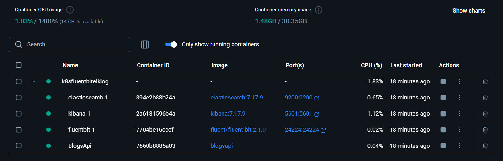
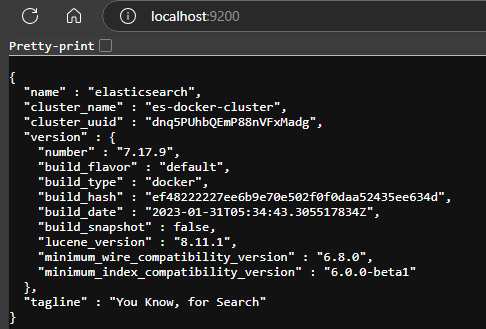
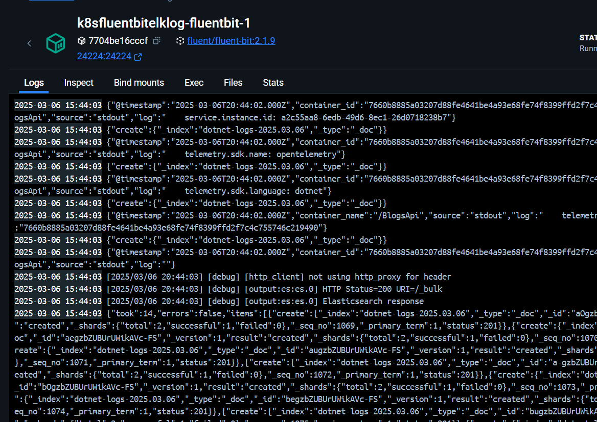
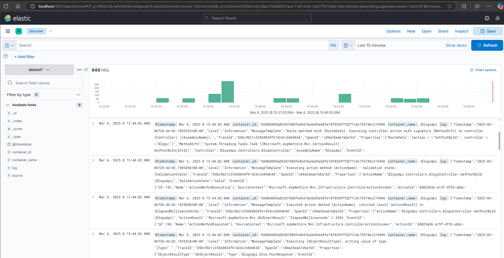
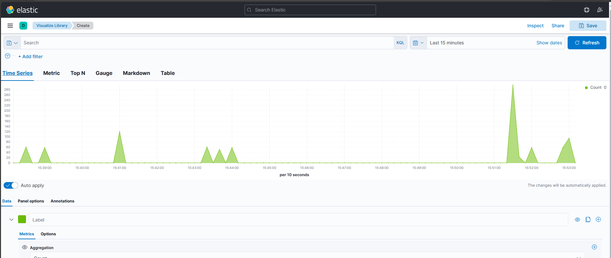
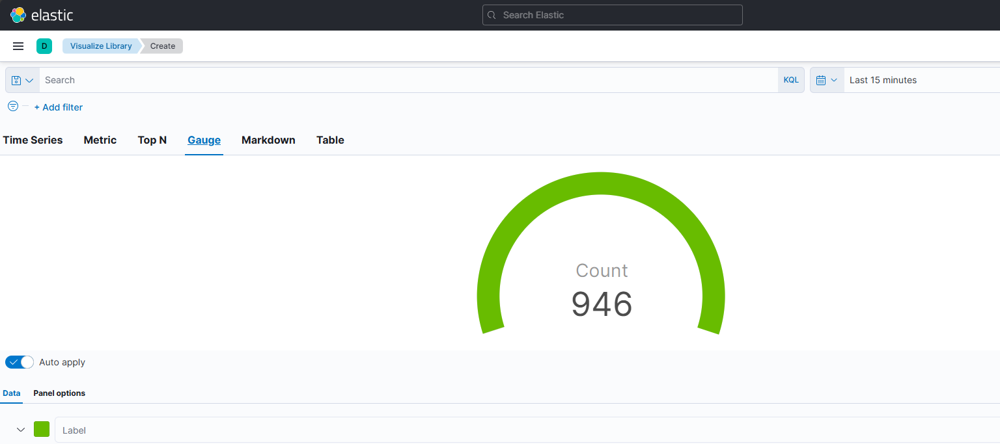
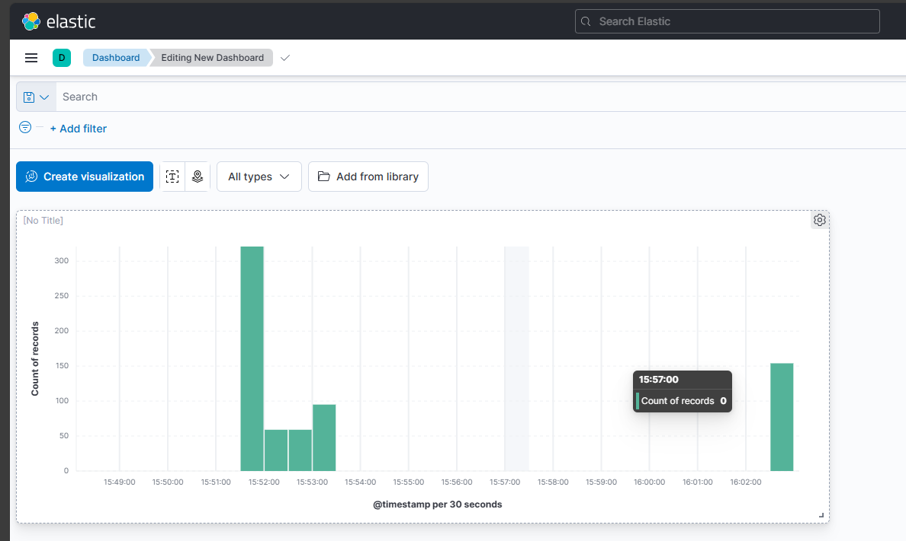

# Collect logs from Kubernetes Pods using Fluentbit and persist in Elastic search and visualize in kibana

Steps
1. Created a .Net Application with some models
2. Used EntityFramework.InMemoryDatabase to add the Database context
3. Added Serilog and configured logs 
4. Tested the endpoints and locally
5. Created Docker file for the .Net app
6. Tested the application using docker file in the docker desktop
7. Created the Docker-compose file and set up the service
8. Build the docker image  & Created a Tag for the docker image.
9. push the image to the Docker hub
10. Created Kubernetes files
    i. Created the Namespace file
    ii. created the deployment file contains deployment kind and service
    iii. Applied the namespace and deployment.
    iv. Port forward the service from Pods container to hostmachine
    v. Test the application functionality and log generation (used both Headlamp and kubectl command to view logs from Pod)


```bash
kubectl get all

kubectl apply -f namespace.yaml

kubectl apply -f deployment.yaml

kubectl get pods -n logging

kubectl get svc -n logging

# Format: kubectl port-forward service/<service-name> <host-port>:<target-port> -n <namespace>
kubectl port-forward service/blogs-api-service 5000:5000 8080:8080 -n logging


# Format: kubectl port-forward pod/<pod-name> <host-port>:<container-port> -n <namespace>
kubectl port-forward pod/blogs-api-<pod-id> 5000:8080 5001:8081 -n logging


To View the logs in the pods
# Get pod name
kubectl get pods -n logging

# Check logs
kubectl logs <pod-name> -n logging


kubectl delete -f deployment.yaml

```

## Use Helm chart to install fluentbit and ELK stack

- Add the required Helm repositories
```bash
# Add Fluent Bit helm repo
helm repo add fluent https://fluent.github.io/helm-charts

# Add Elastic helm repo
helm repo add elastic https://helm.elastic.co

# Update repos
helm repo update

```


## Search the repo ( In Windows use the Git bash prompt to run this commands)

```bash
helm search repo fluent
```


```bash
# display all the information in te repo
helm search repo elastic

# display just the names in the helm repo
helm search repo elastic | awk '{print $1}'

# using Cut
helm search repo elastic | cut -f1

# using grep and cut
helm search repo elastic | grep "elastic/" | cut -f1

```


## Create the Helm value files
- Created the helm value file for elasticsearch (elasticsearch-values.yaml)
- Created the helm value file for fluent-bit(fluent-bit-values.yaml)
- Created the helm value file for kibana (kibana-values.yaml)

## Install the components using helm

```bash
helm install elasticsearch elastic/elasticsearch \
  --namespace logging \
  --values elasticsearch-values.yaml
```

  

# Get the password for Elastic Search 
```bash
# Get Elasticsearch password
PASSWORD=$(kubectl get secret -n logging elasticsearch-master-credentials -o jsonpath="{.data.password}" | base64 --decode)
echo "Elasticsearch password: $PASSWORD"
```


qWewgKjq2VKkF8X9

```bash
# Install Kibana
helm install kibana elastic/kibana \
  --namespace logging \
  --values kibana-values.yaml \
  --set elasticsearchPassword=$PASSWORD


# Install Fluent Bit
helm install fluent-bit fluent/fluent-bit \
  --namespace logging \
  --values fluent-bit-values.yaml \
  --set config.outputs.es.http_passwd=$PASSWORD
```

## Verify the installation

```bash
# Check all resources in logging namespace
kubectl get all -n logging


helm uninstall elasticsearch -n logging

Delete the ConfigMap manually
kubectl delete configmap kibana-kibana-helm-scripts -n logging

kubectl delete all,configmap,secret -l release=kibana -n logging

# Delete all resources with label release=kibana
kubectl delete all,configmap,secret -l release=kibana -n logging

# Or delete specific resources
kubectl delete deployment,service,configmap,secret -l app=kibana -n logging

# Delete the helm release
helm delete kibana -n logging --no-hooks

# Delete configmaps containing "kibana"
kubectl delete configmap -n logging $(kubectl get configmap -n logging | grep kibana | awk '{print $1}')

# Delete any remaining kibana resources
kubectl delete all -n logging -l app=kibana


# Get recent logs
kubectl logs -n logging elasticsearch-master-0 --previous


helm uninstall elasticsearch -n logging

Clean up persistet Volume (if needed)
kubectl delete pvc -l app=elasticsearch-master -n logging


Reinstall Elastic Search with new Configuration


```json
{"@timestamp":"2025-03-05T22:02:41.587Z", "log.level":"ERROR", "message":"fatal exception while booting Elasticsearch", "ecs.version": "1.2.0","service.name":"ES_ECS","event.dataset":"elasticsearch.server","process.thread.name":"main","log.logger":"org.elasticsearch.bootstrap.Elasticsearch","elasticsearch.node.name":"elasticsearch-master-0","elasticsearch.cluster.name":"elasticsearch","error.type":"java.lang.IllegalArgumentException","error.message":"setting [cluster.initial_master_nodes] is not allowed when [discovery.type] is set to [single-node]","error.stack_trace":"java.lang.IllegalArgumentException: setting [cluster.initial_master_nodes] is not allowed when [discovery.type] is set to [single-node]\n\tat org.elasticsearch.server@8.5.1/org.elasticsearch.cluster.coordination.ClusterBootstrapService.<init>(ClusterBootstrapService.java:87)\n\tat org.elasticsearch.server@8.5.1/org.elasticsearch.cluster.coordination.Coordinator.<init>(Coordinator.java:279)\n\tat org.elasticsearch.server@8.5.1/org.elasticsearch.discovery.DiscoveryModule.<init>(DiscoveryModule.java:193)\n\tat org.elasticsearch.server@8.5.1/org.elasticsearch.node.Node.<init>(Node.java:876)\n\tat org.elasticsearch.server@8.5.1/org.elasticsearch.node.Node.<init>(Node.java:318)\n\tat org.elasticsearch.server@8.5.1/org.elasticsearch.bootstrap.Elasticsearch$2.<init>(Elasticsearch.java:214)\n\tat org.elasticsearch.server@8.5.1/org.elasticsearch.bootstrap.Elasticsearch.initPhase3(Elasticsearch.java:214)\n\tat org.elasticsearch.server@8.5.1/org.elasticsearch.bootstrap.Elasticsearch.main(Elasticsearch.java:67)\n"}
```
```bash
# Delete the helm release
helm uninstall elasticsearch -n logging

# Delete any PVCs
kubectl delete pvc -l app=elasticsearch-master -n logging

# Delete any configmaps
kubectl delete configmap -l app=elasticsearch-master -n logging

# Delete any secrets
kubectl delete secret -l app=elasticsearch-master -n logging
```


- Wait for all resources to be cleaned up
```bash
kubectl get all,pvc,configmap,secret -l app=elasticsearch-master -n logging
```
- Install the new configuration
```bash
helm install elasticsearch elastic/elasticsearch \
  --namespace logging \
  --values elasticsearch-values.yaml \
  --set masterService.enabled=false \
  --set discovery.type=single-node

```

helm install elasticsearch elastic/elasticsearch \
  --namespace logging \
  --values elasticsearch-values.yaml

check the status
kubectl get pods -n logging -w


## Kibana installation errors


# Remove the helm release
helm uninstall kibana -n logging --no-hooks

# Delete the service account
kubectl delete serviceaccount pre-install-kibana-kibana -n logging

# Delete any other Kibana-related resources
kubectl delete serviceaccount,configmap,secret -l app=kibana -n logging

### Double check that all resources are removed
# Check for any remaining kibana resources
kubectl get all,serviceaccount,configmap,secret -l app=kibana -n logging


# Cleanup
```bash

helm list -n logging

# Delete individual releases
helm uninstall elasticsearch -n logging
helm uninstall kibana -n logging
helm uninstall fluent-bit -n logging

# Or delete all releases in the namespace at once
helm list -n logging -q | xargs helm uninstall -n logging

# Delete PVCs
kubectl delete pvc --all -n logging

# Delete ConfigMaps
kubectl delete configmap --all -n logging

# Delete Secrets
kubectl delete secret --all -n logging

# Delete Services
kubectl delete svc --all -n logging

# Delete all resources with common labels
kubectl delete all,pvc,configmap,secret -l app=elasticsearch-master -n logging
kubectl delete all,pvc,configmap,secret -l app=kibana -n logging
kubectl delete all,pvc,configmap,secret -l app=fluent-bit -n logging

kubectl delete namespace logging

# Then recreate the namespace if needed
kubectl create namespace logging

# Check for any remaining resources
kubectl get all,pvc,configmap,secret -n logging

# Check for any remaining PVs (these are cluster-wide resources)
kubectl get pv | grep logging
# List PVs
kubectl get pv | grep logging

# Delete stuck PVs
kubectl delete pv <pv-name>

# Delete all Helm releases
helm list -n logging -q | xargs helm uninstall -n logging

# Delete all resources
kubectl delete all,pvc,configmap,secret --all -n logging

# Delete the namespace itself
kubectl delete namespace logging

# Recreate namespace if needed
kubectl create namespace logging


```

# Using Docker Compose









In Kibana, did the below steps.

- Go to the main menu (hamburger menu on the left side)

- Click on "Analytics" → "Discover"

 - If this is your first time:

You'll need to create an index pattern

    - Click "Create index pattern"

    - Enter "dotnet-logs-*" as the pattern

    - Click "Next step"

    - Select "@timestamp" as the Time field

    - Click "Create index pattern"

    - Once the index pattern is created:

    - Go back to "Discover"

    - Select your "dotnet-logs-*" pattern from the dropdown at the top

    - You should now see your logs in the main view






