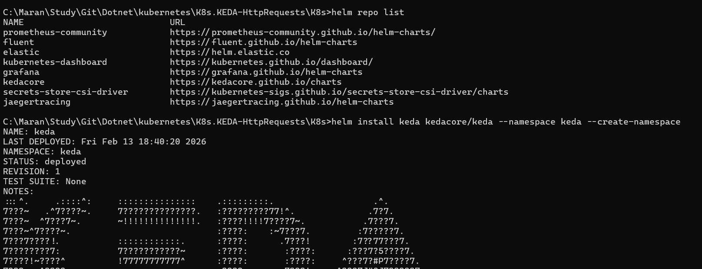
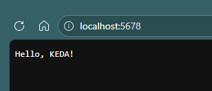
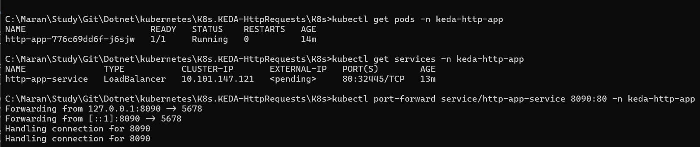
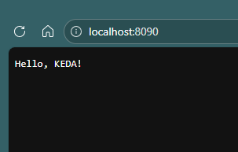
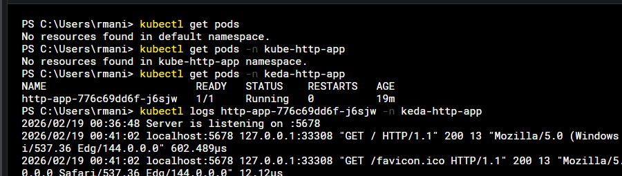

```bash
helm repo add kedacore https://kedacore.github.io/charts
helm repo update
helm install keda kedacore/keda --namespace keda --create-namespace
# Create the Namespace
kubectl apply -f namespace.yaml

# Apply the Deployment
kubectl apply -f deployment.yaml -n keda-http-app

# Apply the Service
kubectl apply -f service.yaml -n keda-http-app

# Port forward to access the service locally
kubectl port-forward service/http-app 8090:80 -n keda-http-app

# Check the Logs in the Pods
kubectl logs <pod-name> -n keda-http-app

# To execute shell command on the pod
kubectl exec <pod-name> -n keda-http-app -- bash

kubectl exec -it pod -n ns -- /bin/sh

```












## Cleanup commands
```bash
# Uninstall KEDA
helm uninstall keda -n keda

# Delete the Namespace
kubectl delete namespace keda

# Delete the Deployment
kubectl delete deployment http-app -n keda-http-app
# Delete the Service
kubectl delete service http-app -n keda-http-app
```

