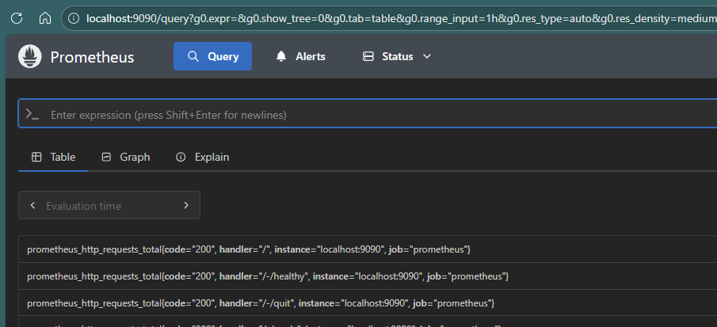
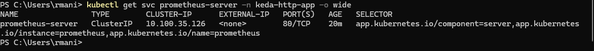
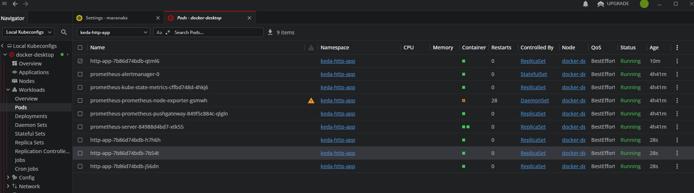

```bash
helm repo add kedacore https://kedacore.github.io/charts
helm repo update
helm install keda kedacore/keda --namespace keda --create-namespace
# Create the Namespace
kubectl apply -f namespace.yaml

# Apply the Deployment
kubectl apply -f deployment.yaml -n keda-http-app

# Apply the Service
kubectl apply -f service.yaml -n keda-http-app

# Port forward to access the service locally
kubectl port-forward service/http-app 8090:80 -n keda-http-app

# Check the Logs in the Pods
kubectl logs <pod-name> -n keda-http-app

# To execute shell command on the pod
kubectl exec <pod-name> -n keda-http-app -- bash

kubectl exec -it pod -n ns -- /bin/sh

```


# Install Promeethus using Helm
```bash
helm repo add prometheus-community https://prometheus-community.github.io/helm-charts
helm repo update
helm install prometheus prometheus-community/prometheus -n keda-http-app

# Access Prometheus UI
kubectl port-forward -n keda-http-app svc/prometheus-server 9090:80
# Open: http://localhost:9090

```



## Get the Service Information of Prometheus
- Use the below command to get the Prometheus Service Information.
- Map that in the ScaledObject file.
- Apply the scaledObject file.
- Check the Request updated in Prometheus.

```bash
kubectl get svc prometheus-server -n keda-http-app -o wide

```



- Based on the above my server address is 
serverAddress: http://prometheus-server.keda-http-app.svc.cluster.local:80

Format: http://<service-name>.<namespace>.svc.cluster.local:<port>


## Installing Hey
```bash
# For Linux
wget https://hey-release.s3.us-east-2.amazonaws.com/hey_linux_amd64.tar.gz
tar -xvf hey_linux_amd64.tar.gz
# For Windows
# Download the hey_windows_amd64.zip file from the releases page:

```


## Run the Hey script
```bash
hey -z 60s -c 50 http://localhost:8090/

#or Curl command
 for i in {1..1000}; do curl http://localhost:8090/hello & done
``` 



## Cleanup commands
```bash
# Uninstall KEDA
helm uninstall keda -n keda

# Delete the Namespace
kubectl delete namespace keda

# Delete the Deployment
kubectl delete deployment http-app -n keda-http-app
# Delete the Service
kubectl delete service http-app -n keda-http-app
```

