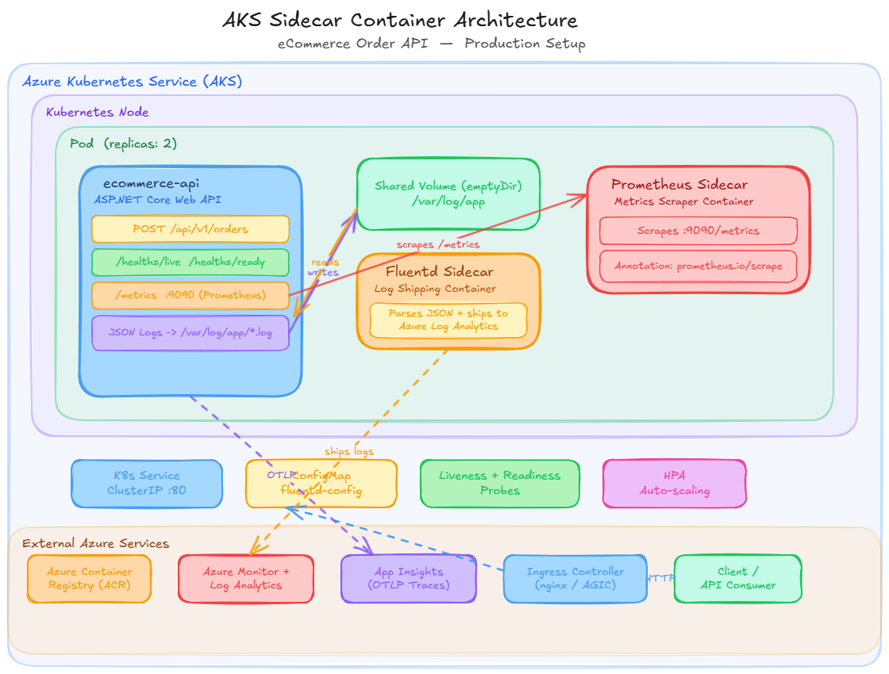
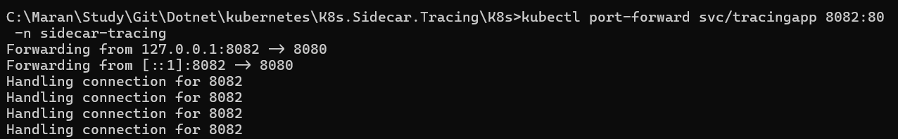
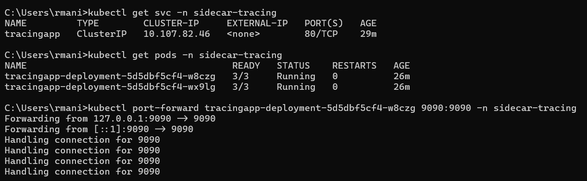
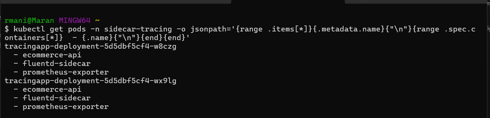

### Architecture



- `ecommerce-api` — the main ASP.NET Core container exposing the order endpoint, health probes, and a Prometheus metrics endpoint
- `Fluentd sidecar` — reads JSON logs from the shared emptyDir volume and ships them to Azure Monitor
- `Prometheus sidecar` — scrapes /metrics on :9090 from the main container

`Shared Volume` — the key mechanism connecting the main app and Fluentd; both containers mount /var/log/app from the same emptyDir

K8s resources (below the pod): Service, ConfigMap (for Fluentd config), liveness/readiness probes, and HPA for auto-scaling

External Azure services (bottom): ACR for image storage, Azure Monitor/Log Analytics for logs, App Insights for distributed traces (via OTLP), and the Ingress Controller routing client traffic in

### Step 1: Setup Kubernetes Context

```bash
# Check available contexts
kubectl config get-contexts

# Set Docker Desktop context
kubectl config use-context docker-desktop

# Verify current context
kubectl config current-context
```

### Step 2: Deploy Application with Sidecar

```bash
kubectl apply -f namespace.yaml

kubectl apply -f configmap.yaml

kubectl apply -f service.yaml

kubectl apply -f deployment.yaml
```

### Port Forward the Service and Prometheus

```bash
kubectl port-forward svc/tracingapp 8082:80

kubectl get pods -n sidecar-tracing

kubectl port-forward tracingapp-deployment-5d5dbf5cf4-w8czg 9090:9090 -n sidecar-tracing

curl http://localhost:9090/metrics
```




- List the containers inside the Pods

```bash
kubectl get pods -n sidecar-tracing -o jsonpath='{range .items[*]}{.metadata.name}{"\n"}{range .spec.containers[*]}  - {.name}{"\n"}{end}{end}'
```
