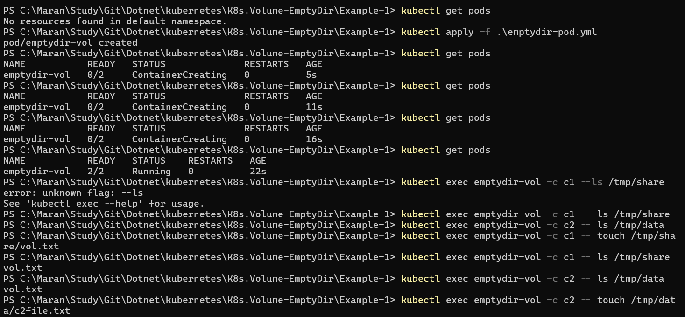
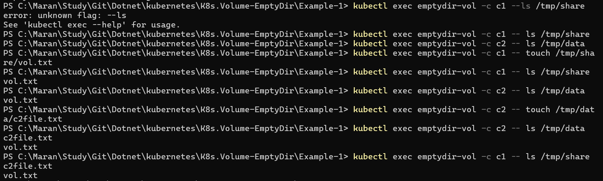

```bash
# Kubernetes commands
kubectl apply -f emptydir-pod.yaml

kubectl get pods

kubectl exec emptydir-vol -c c1 -- ls /tmp/share

kubectl exec emptydir-vol -c c2 -- ls /tmp/data

kubectl exec emptydir-vol -c c1 -- touch /tmp/share/vol.txt

kubectl exec emptydir-vol -c c1 --ls /tmp/share

kubectl exec emptydir-vol -c c2 --ls /tmp/data

kubectl exec emptydir-vol -c c2 -- touch /tmp/data/c2vol.txt

kubectl exec emptydir-vol -c c2 -- ls /tmp/data

kubectl exec emptydir-vol -c c1 -- ls /tmp/share

kubectl delete pod pod-name

kubectl delete -f emptydir-pod.yml

```



