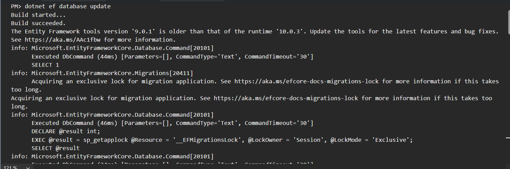
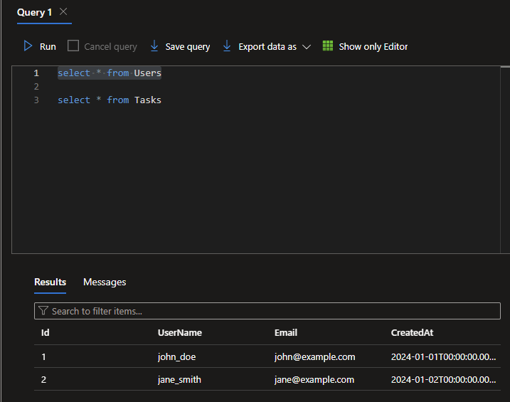
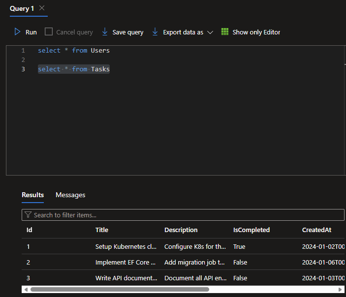
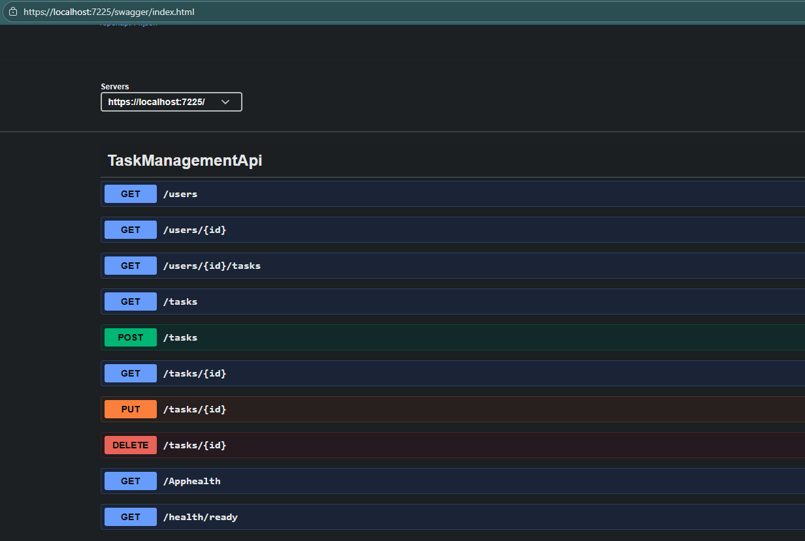

# Apply Migration when running the App in Kubernetes









## Build the Docker Image with tag and Push to Docker Hub
```bash
docker build -t <dockerhub-username>/dotnet-migration:latest .
docker push <dockerhub-username>/dotnet-migration:latest
```

## Create a Kubernetes Deployment and Service
```yaml
