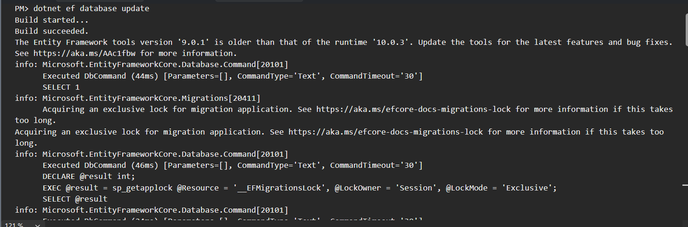
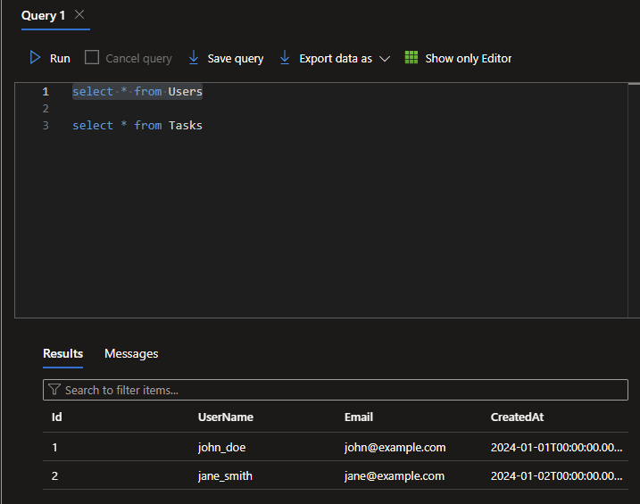
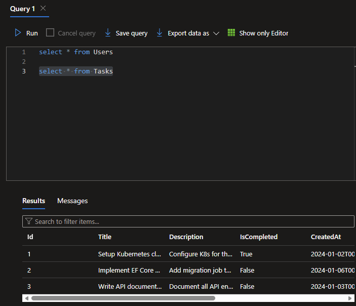
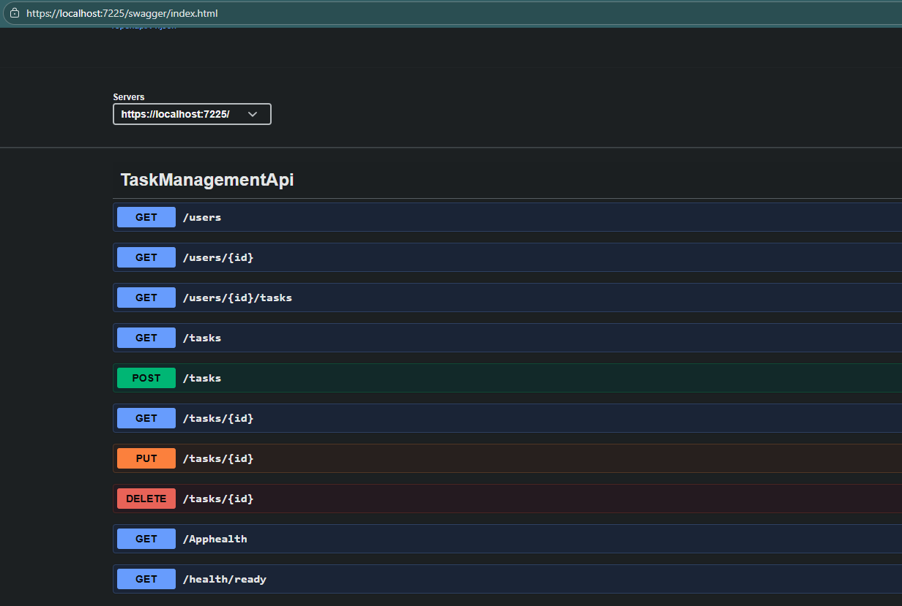

# Apply Migration when running the App in Kubernetes


- Build the same Dockerfile.
- But target different stages (runtime vs migration)
- This produces two different images with different purposes









## Build the Docker Image with tag and Push to Docker Hub
```bash
# Build application image (runtime)
docker build -t taskmanagementapi:1.0.0 --target runtime .

# Build migration image
docker build -t taskmanagementapi-migration:1.0.0 --target migration .

# Verify images
docker images | grep taskmanagementapi

```
### Tag and Push the images

```bash
# For Docker Hub (replace 'yourusername')
docker tag taskmanagementapi:1.0.0 yourusername/taskmanagementapi:1.0.0
docker tag taskmanagementapi-migration:1.0.0 yourusername/taskmanagementapi-migration:1.0.0

docker push yourusername/taskmanagementapi:1.0.0
docker push yourusername/taskmanagementapi-migration:1.0.0

# OR for local Kubernetes (Docker Desktop/Minikube - no push needed)
# Just use the local images directly

## Create a Kubernetes Deployment and Service
```
Test Images Locally 
```bash
# Test migration image locally
docker run --rm \
  -e "ConnectionStrings__DefaultConnection=Server=host.docker.internal;Database=TaskManagementDb;User Id=sa;Password=YourStrong@Passw0rd;TrustServerCertificate=True;" \
  taskmanagementapi-migration:1.0.0

# Test runtime image
docker run --rm -p 8080:8080 \
  -e "ConnectionStrings__DefaultConnection=Server=host.docker.internal;Database=TaskManagementDb;User Id=sa;Password=YourStrong@Passw0rd;TrustServerCertificate=True;" \
  taskmanagementapi:1.0.0
  ```

  Usage
```bash
# Make executable
chmod +x build-images.sh

# Build for local Kubernetes
./build-images.sh 1.0.0 local

# Build and push to Docker Hub
./build-images.sh 1.0.0 yourusername

# Build and push to ACR
./build-images.sh 1.0.0 yourregistry.azurecr.io
```