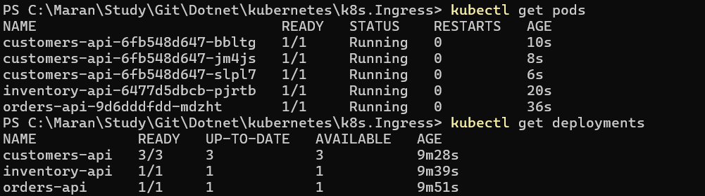
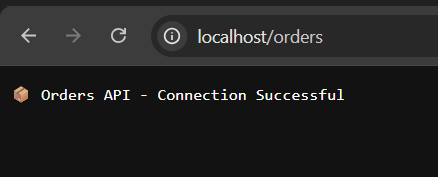
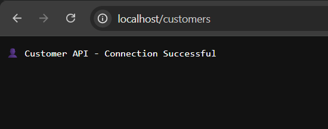
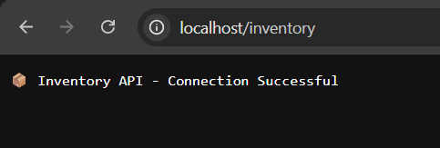

# Kubernetes Ingress Demo (Docker Desktop)

Demonstrates path-based routing using NGINX Ingress Controller with three mock APIs running locally.

## Architecture

```
localhost/orders/*     → orders-service     (1 replica)
localhost/inventory/*  → inventory-service  (1 replica)
localhost/customers/*  → customers-service  (3 replicas)
```

## Prerequisites

- Docker Desktop with Kubernetes enabled
- `kubectl` configured to use the `docker-desktop` context

Verify:
```bash
kubectl config current-context   # should print: docker-desktop
```

## 1. Install NGINX Ingress Controller

```bash
kubectl apply -f https://raw.githubusercontent.com/kubernetes/ingress-nginx/controller-v1.10.1/deploy/static/provider/cloud/deploy.yaml
```

Wait until the controller pod is ready:
```bash
kubectl wait --namespace ingress-nginx \
  --for=condition=ready pod \
  --selector=app.kubernetes.io/component=controller \
  --timeout=120s
```

## 2. Deploy

Apply all manifests from this folder:
```bash
kubectl apply -f .
```

Verify everything is running:
```bash
kubectl get deployments
kubectl get services
kubectl get ingress
```

## 3. Test

```bash
curl http://localhost/orders
curl http://localhost/inventory
curl http://localhost/customers
```

Expected responses:
| Endpoint | Response |
|---|---|
| `/orders` | 📦 Orders API - Connection Successful |
| `/inventory` | 📦 Inventory API - Connection Successful |
| `/customers` | 👤 Customer API - Connection Successful |

## 4. Teardown

Remove the app manifests:
```bash
kubectl delete -f .
```

Remove the NGINX Ingress Controller:
```bash
kubectl delete -f https://raw.githubusercontent.com/kubernetes/ingress-nginx/controller-v1.10.1/deploy/static/provider/cloud/deploy.yaml
```

## Notes

- The `nginx.ingress.kubernetes.io/rewrite-target: /$2` annotation strips the path prefix before forwarding to the backend (e.g. `/orders/123` → `/123`).
- `hashicorp/http-echo` listens on port `5678` and echoes the `-text` argument as the HTTP response body.







