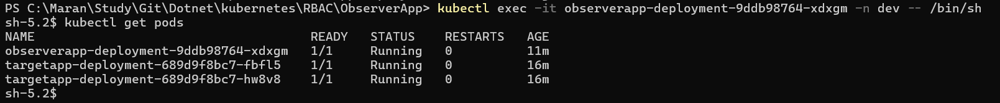
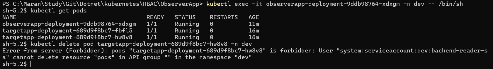
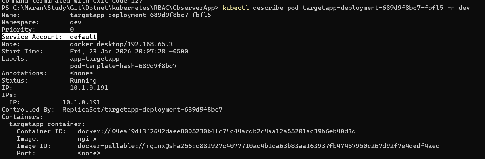
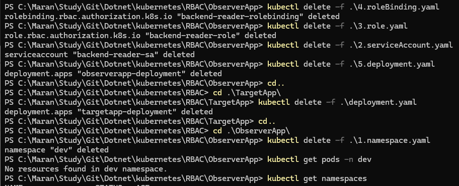

# RBAC in Kubernetes
This repository contains YAML configuration files to demonstrate Role-Based Access Control (RBAC) in Kubernetes. The configurations include the creation of a namespace, role, service account, and role binding.

## Defintions:
RBAC:
Role-Based Access Control (RBAC) is a method of regulating access to computer or network resources based on the roles of individual users within an enterprise. In Kubernetes, RBAC is used to control access to the Kubernetes API and resources.

*Role*:
A Role in Kubernetes defines a set of permissions within a specific namespace. It specifies what actions can be performed on which resources.

*RoleBinding*:
A RoleBinding in Kubernetes grants the permissions defined in a Role to a user or set of users (including Service Accounts) within a specific namespace.

*Service Account*:
A Service Account in Kubernetes is an account for processes that run in a Pod. It provides an identity for processes that run in a Pod to interact with the Kubernetes API.

## Files:
- 1.namespace.yaml - Creates a namespace named "dev".
- 2.role.yaml - Defines a Role named "backend-reader-role" in the "dev" namespace with permissions to read pods, services, and configmaps.
- 3.roleBinding.yaml - Binds the "backend-reader-role" to the "backend-reader-sa" Service Account in the "dev" namespace.
- 4.serviceAccount.yaml - Creates a Service Account named "backend-reader-sa" in the "dev" namespace.


Usage:
To apply these configurations to your Kubernetes cluster, use the following commands:


```bash

kubectl apply -f 1.namespace.yaml
kubectl apply -f 2.serviceAccount.yaml
kubectl apply -f 3.role.yaml
kubectl apply -f 4.roleBinding.yaml
# Make sure to apply them in the order listed above to ensure that dependencies are met.

# create the observer pod.
kubectl apply -f 5.deployment.yaml

# check the Role using
kubectl get role -n dev
kubectl get role backend-reader-role -n dev -o yaml

# check the service account
kubectl get sa -n dev


# verify the observer pod logs.
kubectl get pods -n dev
kubectl describe pod <podname> -n dev

# Check the Service account in the output of the describe pod command.
# once done, login to pod using exec command.
kubectl exec -it observerapp-deployment-9ddb98764-xdxgm -n dev -- /bin/sh
# once inside the pod, use the following command to verify access to resources.
# I am running
kubectl get pods
```



```bash
# we will try deleting the other pod within this observer pod.
kubectl delete pod backend-app-deployment-5d7f9f6b7b-abcde -n dev
```

```bash
# Check the Pod describe for the target pod
kubectl describe pod backend-app-deployment-5d7f9f6b7b-abcde -n dev
# If you check the service account it will display as default.
```

```

### Conclusion:
This repository provides a basic example of how to implement RBAC in Kubernetes using Roles, RoleBindings, and Service Accounts. By following the provided YAML configurations and commands, you can set up a secure access control mechanism for your Kubernetes resources.

### Clean-up:
To clean up the resources created by this example, use the following commands:
```bash
kubectl delete -f 4.roleBinding.yaml
kubectl delete -f 3.role.yaml
kubectl delete -f 2.serviceAccount.yaml
kubectl delete -f 1.namespace.yaml
kubectl delete -f 5.deployment.yaml
kubectl delete namespace dev
kubectl delete deployment observerapp-deployment -n dev
kubectl delete deployment backend-app-deployment -n dev
kubectl delete pod <podname> -n dev
```
