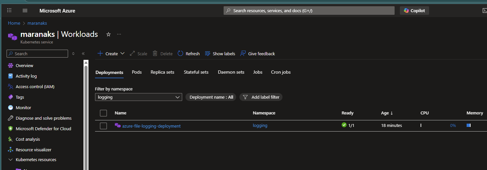
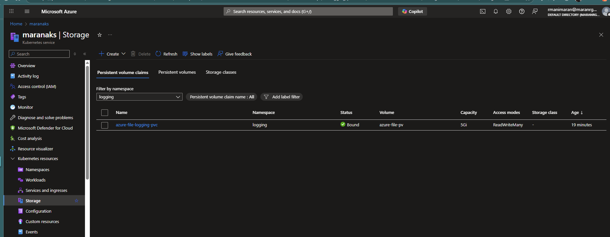
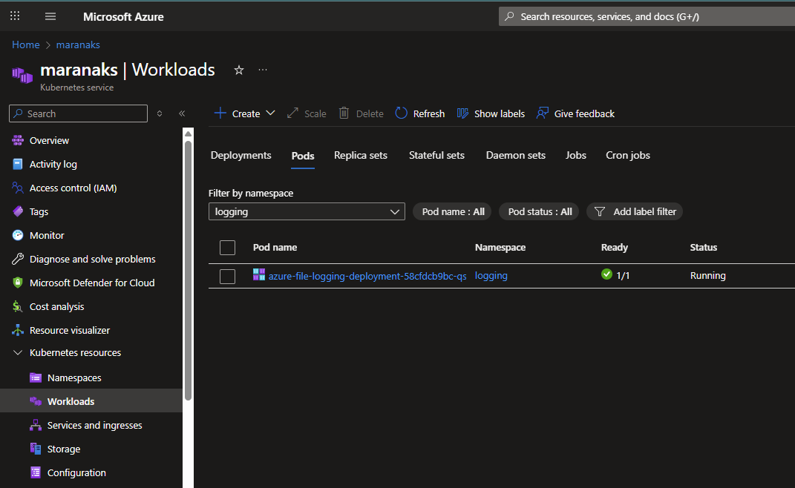
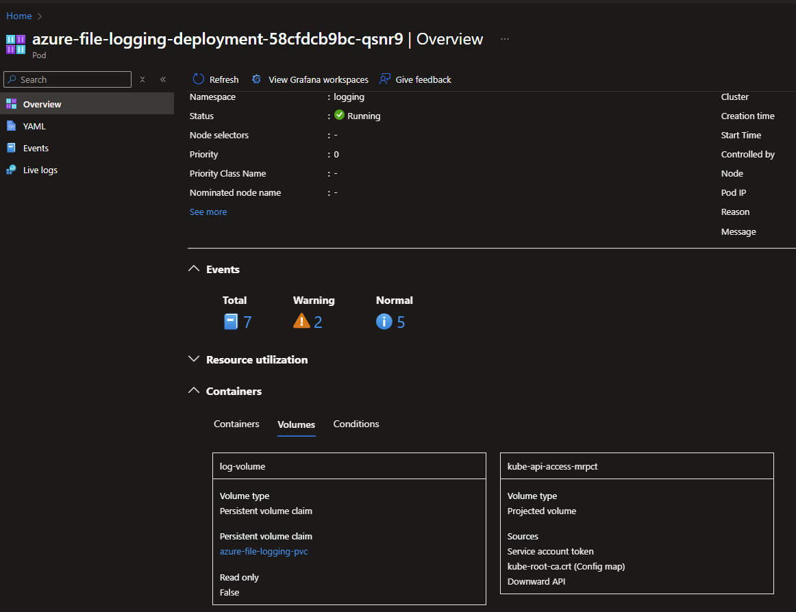
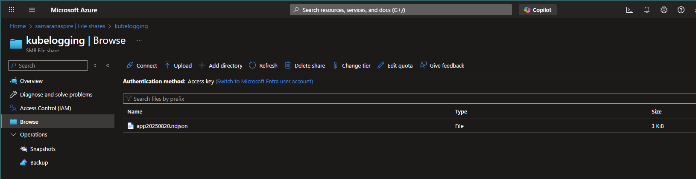
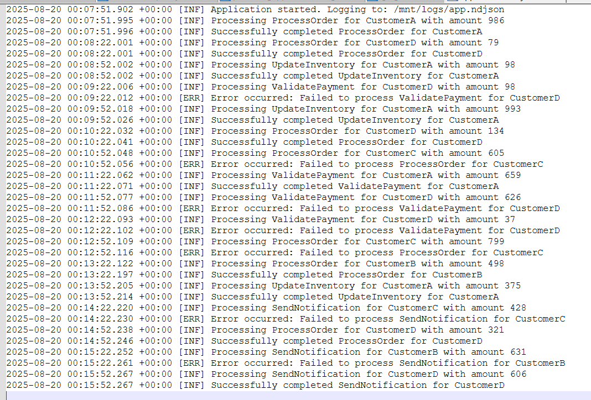

# Checklist
- [ ] Create the console app to do some processing
    - [ ] Add the Serilog Nuget packages
    - [ ] Add the processing logic to generate sample Info and error logs
    - [ ] Set the Enviornment variable LOG_FILE_PATH in lauchsettings file
    - [ ] Run the Console App and test the logs generated in the defined log path
- [ ] Create the Dockerfile
    - [ ] Add the container support for the console app.
    - [ ] Build the docker image
    - [ ] Tag the image with the docker hub repository information
    - [ ] Push the image to the docker hub
- [ ] Create the Docker Compose file
    - [ ] Add the docker compose file to run the console app
    - [ ] Refer the image from Docker hub
    - [ ] Create a .env file and define the environment variable for Docker hub name
    - [ ] Run the app in the container.
    - [ ] Test the generated log in the volume mapped location.
- [ ] Create Azure Storage Account File Share
    - [ ] Create the storage account
    - [ ] Create the file share
    - [ ] Note the Storage account name and key for the storage account
    - [ ] Create base64 string for the storage account name and key
    - [ ] Create the Kubernetes secret to store the storage account name and key

- [ ] Create ACR 
  - [ ] Create the ACR in Azure
  - [ ] Tag the image to the created ACR
  - [ ] Push the image to ACR

- [ ] Create the Kubernetes deployment manifest
    - [ ] Add the deployment.yaml file
    - [ ] Add the service.yaml file
    - [ ] Add the volume and volume mount for the Azure File Share
    - [ ] Add the secret for the storage account name and key 

- [ ] Run the App in the Azure Kubernetes cluster.

docker rm -f processingapp

## Create ACR and Build Image
```bash
# Create ACR (if not exists)
az acr create --resource-group <your-rg> --name <your-acr-name> --sku Basic

# Login to ACR
az acr login --name <your-acr-name>

# Build and push image
docker build -t <your-acr-name>.azurecr.io/processingapp:latest .
docker push <your-acr-name>.azurecr.io/processingapp:latest
```
## Update Deployment Image
In the deployment.yaml, update the image from acr
```yaml
containers:
- name: azure-file-logging
  image: <your-acr-name>.azurecr.io/processingapp:latest
```

## Create ACR Secret for AKS
```bash
# Create secret for ACR access
kubectl create secret docker-registry acr-secret \
  --docker-server=<your-acr-name>.azurecr.io \
  --docker-username=<acr-username> \
  --docker-password=<acr-password> \
  --namespace=logging
```

## Update Deployment with ImagePullSecrets
```yaml
spec:
  template:
    spec:
      imagePullSecrets:
      - name: acr-secret
      containers:
      - name: azure-file-logging
```
## Deploy to AKS
```bash
az aks get-credentials --resource-group <your-rg> --name <your-aks-name>
# Apply manifests
kubectl apply -f manifests/
```
```
# Delete deployment first
kubectl delete deployment azure-file-logging-deployment -n logging

# Delete PVC
kubectl delete pvc azure-file-logging-pvc -n logging

# Delete StorageClass
kubectl delete storageclass azure-file-sc

# Recreate Storage class
kubectl apply -f manifests/03.storageclass.yaml

# Recreate PVC and deployment
kubectl apply -f manifests/04.pvc.yaml
kubectl apply -f manifests/05.deployment.yaml

kubectl get pods --all-namespaces

kubectl get pods -n logging
kubectl describe pod <pod-name> -n logging

kubectl logs <pod-name> -n logging

kubectl get pvc -n logging
kubectl describe pvc azure-file-logging-pvc -n logging

# Grant AKS Managed Identity
# Get AKS managed identity
AKS_IDENTITY=$(az aks show --resource-group k8slogging --name maranaks --query identity.principalId -o tsv)

# Assign role to storage account
az role assignment create \
  --assignee $AKS_IDENTITY \
  --role "Storage File Data SMB Share Contributor" \
  --scope /subscriptions/eb641cab-8d83-43e2-9473-ed8d33be1ffb/resourceGroups/rg-deletethis/providers/Microsoft.Storage/storageAccounts/samaranaspire











