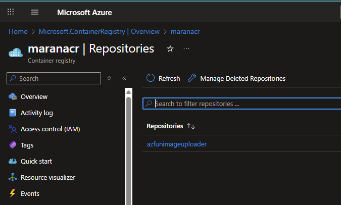
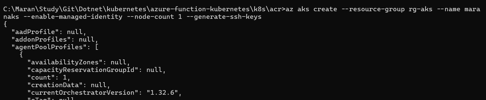
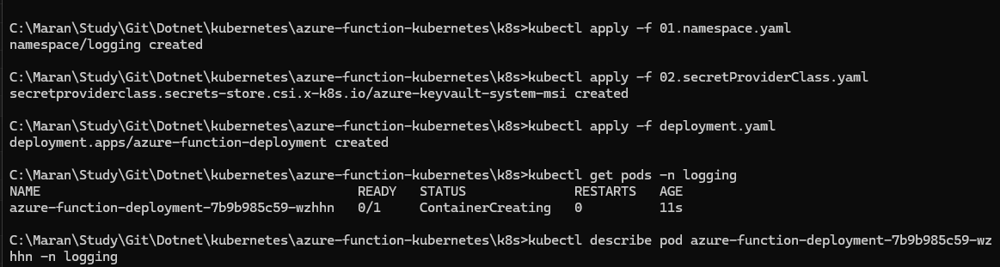
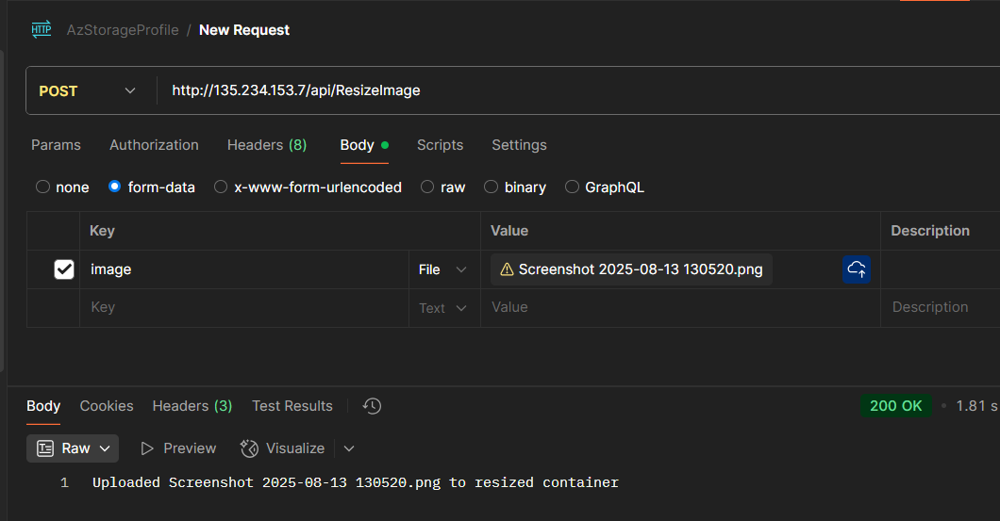
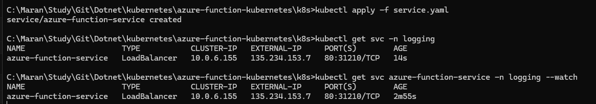
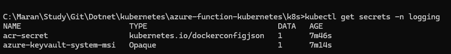
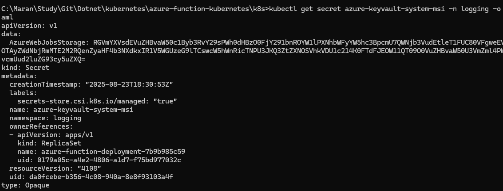

# Azure Functions in Kubernetes

This project demonstrates deploying a .NET 9 Azure Function to Azure Kubernetes Service (AKS) with secure secret management using Azure Key Vault.

## Overview

The application is an HTTP-triggered Azure Function that accepts image uploads via POST requests and stores them in Azure Blob Storage. It showcases:

- Containerized Azure Functions
- Kubernetes deployment with secure secret management
- Azure Key Vault integration using CSI driver
- Managed Identity authentication


## Deployment Steps

### Prerequisites
- Azure CLI installed and logged in
- Docker installed
- kubectl configured
- .NET 9.0 SDK (for local development)

### 1. Azure Resources Setup

**Create Azure Container Registry:**
```bash
az acr create --resource-group <rg-name> --name maranacr --sku Basic
```

**Create Azure Storage Account:**
```bash
az storage account create --name <storage-name> --resource-group <rg-name> --sku Standard_LRS
```

**Create Azure Key Vault:**
```bash
az keyvault create --name kv-maransys --resource-group <rg-name>
```

**Store Storage Connection String in Key Vault:**
```bash
az keyvault secret set --vault-name kv-maransys --name "AzureWebJobsStorage" --value "<storage-connection-string>"
```

### 2. Build and Push Container Image

Run the PowerShell script from the project root:
```powershell
.\k8s\acr\build_and_publish.ps1
```

### 3. AKS Cluster Setup

**Create AKS cluster:**
```bash
az aks create --resource-group <rg-name> --name <aks-name> --enable-managed-identity --node-count 1 --generate-ssh-keys

az aks create --resource-group rg-aks --name maranaks --enable-managed-identity --node-count 1 --generate-ssh-keys

```

**Get AKS credentials:**
```bash
az aks get-credentials --resource-group <rg-name> --name <aks-name>

az aks get-credentials --resource-group rg-aks --name maranaks 
```

**Install Azure Key Vault CSI driver:**
```bash
az aks enable-addons --addons azure-keyvault-secrets-provider --name <aks-name> --resource-group <rg-name>

az aks enable-addons --addons azure-keyvault-secrets-provider --resource-group rg-aks --name maranaks

```

```bash
# Get kubelet identity client ID
az aks show --resource-group rg-aks --name maranaks --query "identityProfile.kubeletidentity.clientId" -o tsv

# Get kubelet identity object ID
az aks show --resource-group rg-aks --name maranaks --query "identityProfile.kubeletidentity.objectId" -o tsv

# Get tenant ID
az account show --query tenantId -o tsv
```

### 4. Configure Managed Identity Access

**Get AKS managed identity:**
```bash
az aks show --resource-group <rg-name> --name <aks-name> --query "identityProfile.kubeletidentity.clientId" -o tsv
```

**Grant Key Vault access:**
```bash
az keyvault set-policy --name kv-maransys --object-id <managed-identity-object-id> --secret-permissions get
```

### 5. Deploy to Kubernetes

**Create namespace:**
```bash
kubectl apply -f k8s/01.namespace.yaml
```

**Create ACR secret:**
```bash
kubectl create secret docker-registry acr-secret \
  --docker-server=maranacr.azurecr.io \
  --docker-username=<acr-username> \
  --docker-password=<acr-password> \
  --namespace=logging
```
```bash
# Get tenant ID
az account show --query tenantId -o tsv

# Get AKS managed identity client ID  
az aks show --resource-group rg-aks --name maranaks --query "identityProfile.kubeletidentity.clientId" -o tsv

```

**Deploy SecretProviderClass:**
```bash
kubectl apply -f k8s/02.SecretProviderClass.yaml
```

**Deploy the application:**
```bash
kubectl apply -f k8s/deployment.yaml
```

### 6. Verify Deployment

**Check pod status:**
```bash
kubectl get pods -n logging
kubectl logs <pod-name> -n logging
```

**Get service endpoint:**
```bash
kubectl get svc -n logging
```

### 7. Test the Function

**Upload an image via POST request:**
```bash
curl -X POST -F "image=@test-image.jpg" http://<service-ip>/api/ResizeImage
```

The function will:
- Accept multipart/form-data with an image file
- Upload the image to Azure Storage blob container "resized"
- Use the connection string securely retrieved from Azure Key Vault
- Return confirmation of successful upload

### Architecture
- **Azure Function**: HTTP-triggered function for image upload
- **Azure Storage**: Blob container for storing uploaded images
- **Azure Key Vault**: Secure storage for connection strings
- **AKS**: Kubernetes cluster hosting the containerized function
- **CSI Driver**: Secure secret injection from Key Vault to pods
















## Clean-up activities

```bash
# Clean up activity
kubectl delete -f service.yaml
kubectl delete -f deployment.yaml
kubectl delete -f 02.SecretProviderClass.yaml
kubectl delete secret acr-secret -n logging
kubectl delete -f 01.namespace.yaml


# delete entire namespace
kubectl delete namespace logging

# delete aks cluster
az aks delete --resource-group rg-aks --name maranaks --yes --no-wait

# delete managed cluster resource group
az group delete --name MC_rg-aks_maranaks_eastus --yes --no-wait

# delete keyvault
az keyvault delete --name kv-maransys --resource-group rg-aks
az keyvault purge --name kv-maransys  # Permanently delete

# delete storage account
az storage account delete --name <storage-account-name> --resource-group rg-aks --yes

# delete container registry
az acr delete --name maranacr --resource-group rg-aks --yes

# delete resource group
az group delete --name rg-aks --yes --no-wait

# remove Kubectl context
kubectl config delete-context maranaks
kubectl config delete-cluster maranaks
```
## Checklist 
[ ] Create the .NET application which will allow the user to upload image to Azure Storage.
[ ] Create Azure Storage account and note the ConnectionString.
[ ] Map the connectionString in the local.settings.json file and test the application functionality in the local environment.
[ ] Build the Docker file.
[ ] Create the Azure Container Registry (ACR). Enable Admin access.
[ ] Use the script file to build and push the image to ACR.
[ ] Create the Azure Kubernetes Service (AKS).
[ ] Create the Azure Key Vault service and create a connection string secret.
[ ] Install CSI driver add-on to AKS.
[ ] Get the CSI driver managed identity client ID.
[ ] Get the tenant ID.
[ ] Grant Key Vault access to CSI driver managed identity.
[ ] Create ACR secret for image pull authentication.
[ ] Deployment:
  [ ] Create the namespace
  [ ] Deploy the SecretProviderClass file
  [ ] Deploy the deployment file
  [ ] Deploy the service file
[ ] Note the Public external IP from the service.
[ ] Test the POST endpoint and ensure the file is uploaded to Azure Storage.