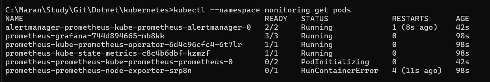
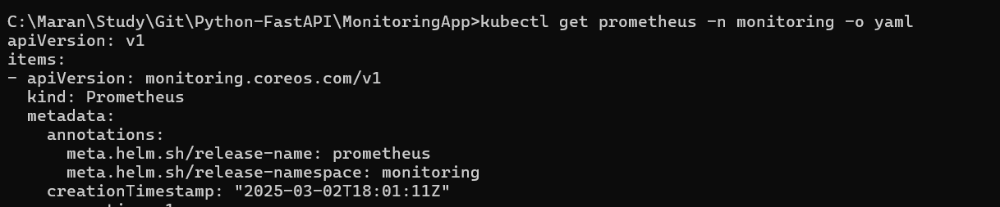

## Installing the Helm 
Follow the steps in the below blog to install the helm in both windows and mac.
```url
https://kubernetestraining.io/blog/installing-helm-on-mac-and-windows
```

## Check the installation of helm and version
```bash
> helm version
```
- The above command will output the helm version as shown below.


## Helm

- `Helm Repository` - Repository contains many Helm Charts
- `Helm Chart` - Its a package that contains all of the configuration files needed to setup a particular software.
    - The popular repository is `Bitnami` which contains many helm charts for example chart for MongoDB, Redis, Postgresql, ElasticSearch etc.
- Another Repository is `Prometheus Community` which contains premetheus related helm charts.

```Url
https://prometheus-community.github.io/helm-charts/
```
## 1. Add the repository
 Use the following command to add the repo

 ```cmd
helm repo add prometheus-community https://prometheus-community.github.io/helm-charts/
```

 
## 2. Search the repository

Use the following command to search the repo

```cmd
helm search repo prometheus-community
```


- To Specifically search for a chart, provide the command as below.
```
helm search repo prometheus-community/kube-prometheus-stack
```


- To list all of the versions that are available in the particular chart.

```
helm search repo prometheus-community/kube-prometheus-stack --versions
```

## 3. Installing the helm chart.

- Every helm chart installation is knows as the helm release.
```
helm install prometheus prometheus-community/kube-prometheus-stack --version 45.7.1 --namespace monitoring --create-namespace
```


## Kube-Prometheus Stack
- This Helm chart release contains 4 main components which get released into our Kubernetes Cluster.
1. Prometheus Operator
2. Node Exporter
3. Kube State Metrics
4. Grafana



- `Prometheus Operator`: 
    - Its like a manager that automates the setup and management of Prometheus monitoring in Kubernetes clusters, making it easier to monitor your applications.
    - It also automatates the creation of Alert Manager, which helps to send Alerts from your Prometheus instance.

- `Node Exporter`:
    - This is a tool that collects and exposes hardware and OS metrics (like CPU usage, memory and disk space) from your Kubernetes nodes.

- `Kube State Metrics`:
    - It listens to the K8s Api and generates metrics about the state of objects like Pods, deployments and nodes, helping you understand what's happening in your cluster.
    - All of the metrics data collected using Node Exporter and Kube State metrics are persisted in Prometheus.

- ` Grafana`:
    - Its a visualization tool that creates beautiful dashboards and graphs from your monitoring data, making it easy to understand and analyze metrics from Prometheus

## Perform Infrastructure Monitoring

- Run the below command to get the services in the K8s cluster.

```
kubectl get svc -n monitoring
```


- Now perform the port-forwarding the service prometheus-operated

```
kubectl port-forward -n monitoring svc/prometheus-operated 9090:9090
```


```
kube_pod_container_status_running
```


## Port Forward Grafana

```
kubectl port-forward -n monitoring svc/prometheus-grafana 3000:80
```

- Now access the grafana in the host machine using the port 3000

### Get Grafana admin credentials

1. Get the Secrets from the kubectl.
```
kubectl get secret -n monitoring prometheus-grafana
```
2. Output the content using
```
kubectl get secret -n monitoring prometheus-grafana -o jsonpath="{.data.admin-password}" | base64 --decode; echo
```
3. Default password will be prom-operator


# Monitor the fast api Application

```
# Apply the deployment to Kubernetes
kubectl apply -f .

# Earlier I mapped the fast-api app port to 8000. But when I do the port forwarding
# I got the error, unable to connect.
# To check the issue ran the below to get the logs.  
kubectl logs -n monitoring -l app=fastapi-app

# got the below log
INFO: Started server process [1]
INFO: Waiting for application startup.
INFO: Application startup complete.
INFO: Uvicorn running on http://0.0.0.0:7755 (Press CTRL+C to quit)


# I made the port mapping change in the deployment.yaml and service.yaml.
# To apply the changed configurations, ran the below command again.

kubectl apply -f deployment.yaml

kubectl apply -f service.yaml

# Now performed the port forward using the below command
kubectl port-forward service/fastapi-app -n monitoring 7755:7755
```

- Now I can able to access the fastapi application. 


- Able to access the metrics endpoint


- Able to access the app endpoints to get the items





- Checking the Premetheus


- Checking the Grafana dashboard


## Uninstall the Helm release.

```
helm uninstall prometheus -n monitoring
```


## Delete the Kubernetes deployment.


```
# Delete the deployment
kubectl delete deployment fastapi-app -n monitoring

# Delete the service
kubectl delete service fastapi-app -n monitoring

# Or, if you want to delete using the yaml files (if you're in the directory containing the yaml files)
kubectl delete -f deployment.yaml
kubectl delete -f service.yaml

# Or, delete everything in one go if you applied using directory
kubectl delete -f .

# To verify nothing is left, you can check:
kubectl get all -n monitoring -l app=fastapi-app

# If you want to delete the monitoring namespace itself (only if you don't have other resources in it)
kubectl delete namespace monitoring
```


