## Run Postgres in docker for local testing
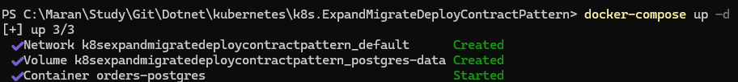

## Initial Local 
- Create the Migrations
- Update the database

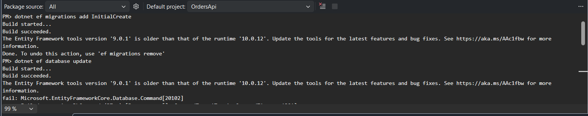

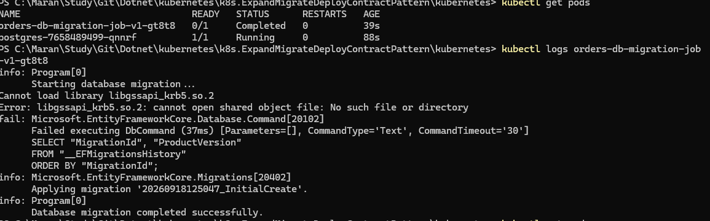

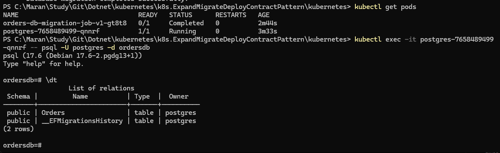

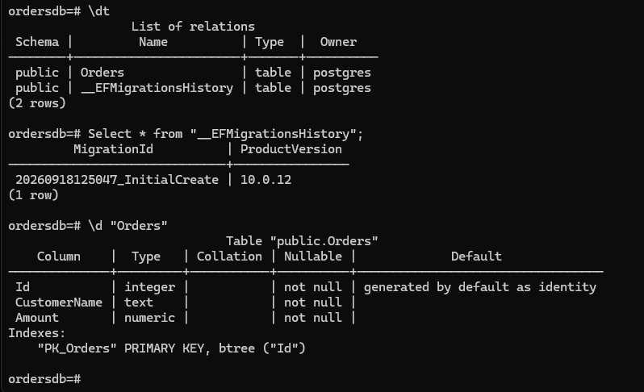

- Run the actual deployment to create the Order Api
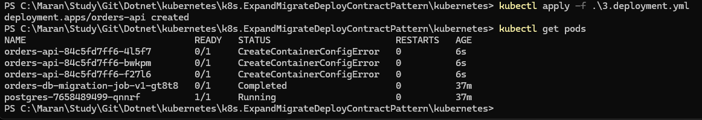

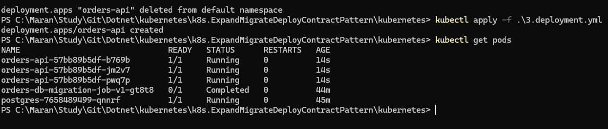

Now change the Order Entity to have Priority which is "Allow Null" column.
- Run the Migration and run update database for local postgres testing
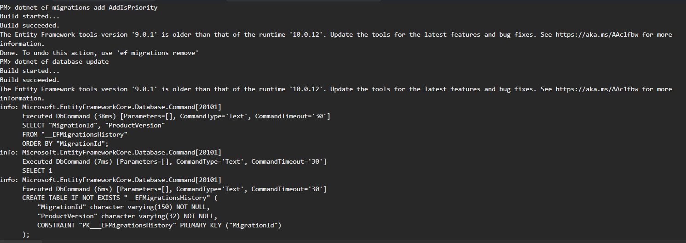

Create the v2 version of docker image and push to docker hub.

## Build the V2 and push to docker hub
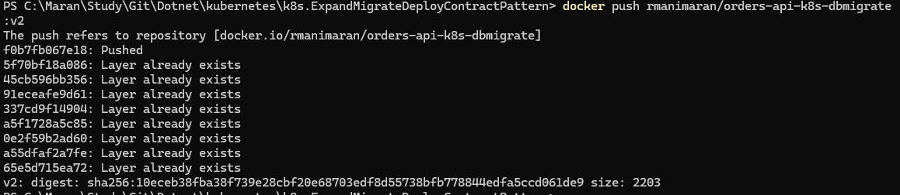 

- Create the migration-v2.expand.yml job and run it.
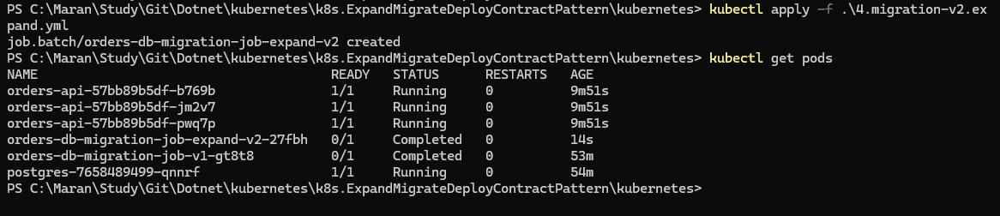

Test the New columns added to the database table

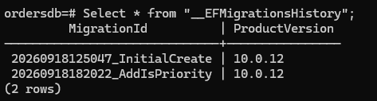

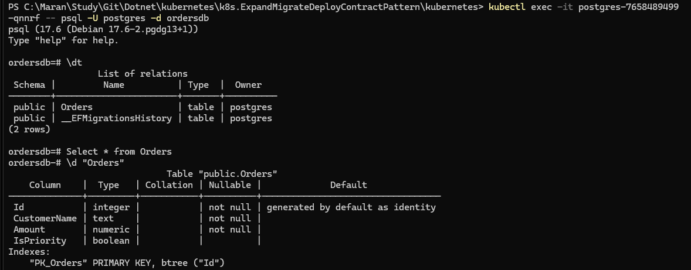

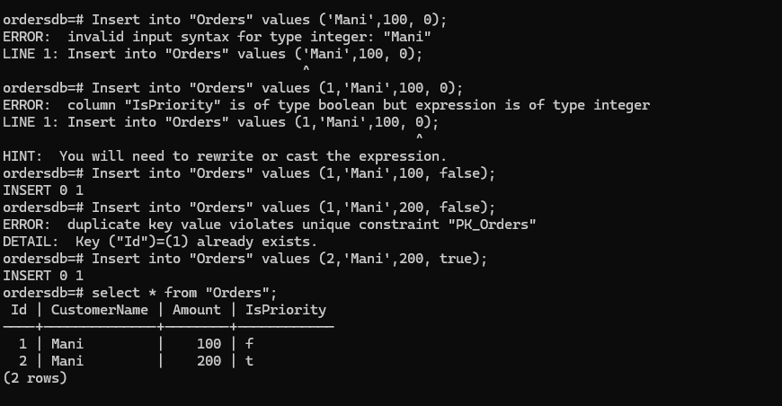

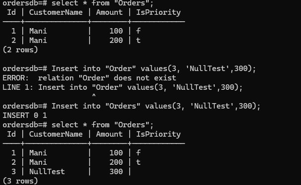

Now update the null value IsPriority column to false using some query.
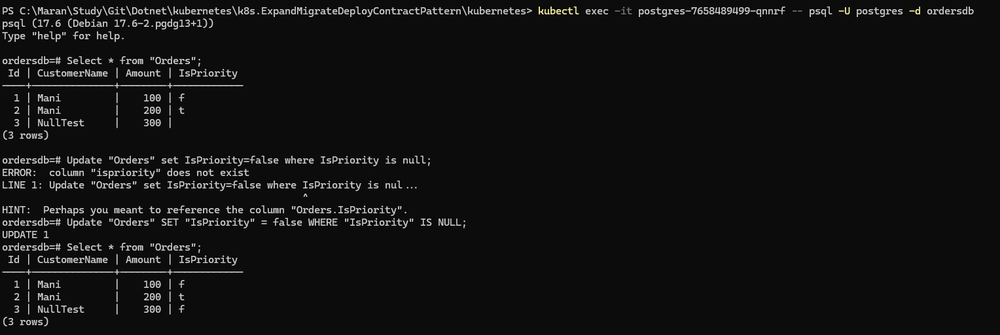

## Now deploy v2 and check the roll-out status
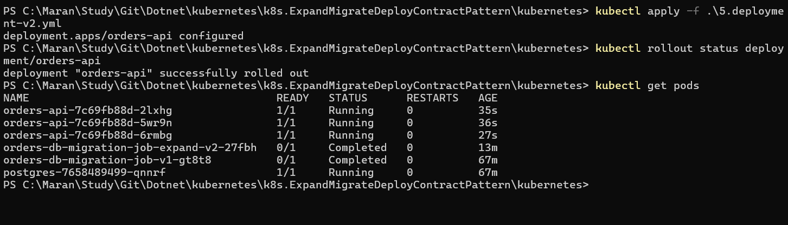

## Now change the Entity IsPriority as Not Null and create Migration
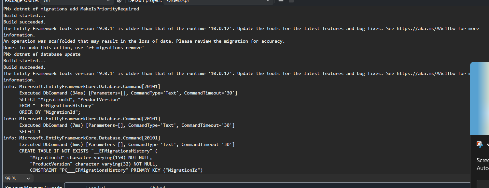

## Build and Push the version 3 image to Docker hub
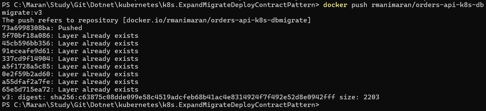

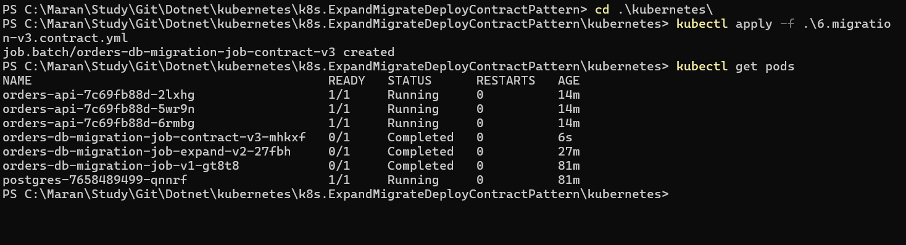

## Check the database now for the column to get updated to Not Null

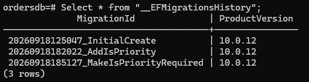

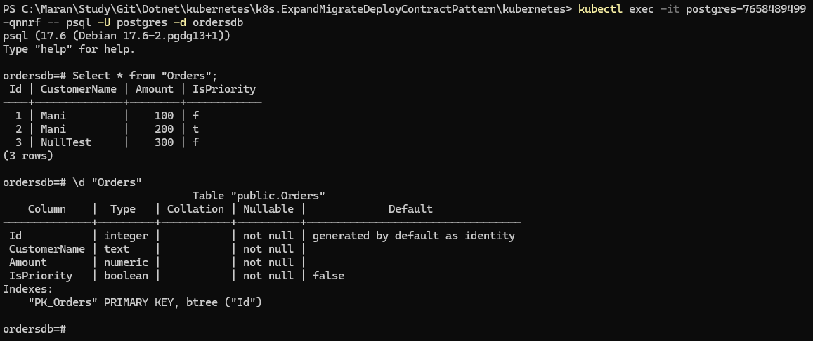

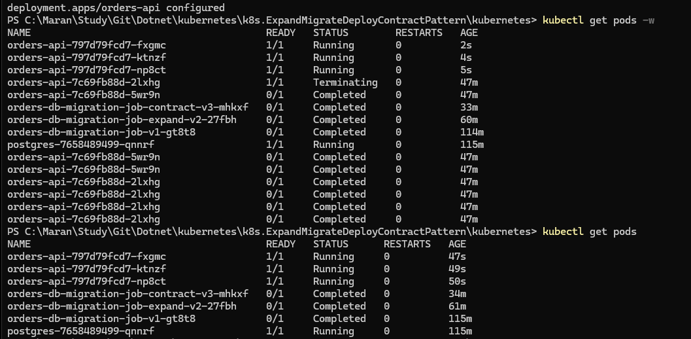

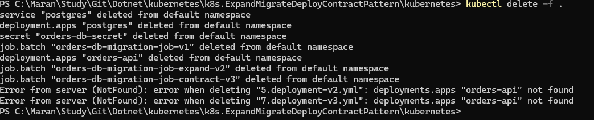
