# Kubernetes Reloader on ConfigMaps & Secrets changes

### Files
`01-namespace.yaml`: To create the namespace

`02-rbac.yaml`: To create the service account and role to be used in reloader

`03-reloader.yaml`: Deployment file for reloader

`04-postgres-config.yaml`: Contains the ConfigMap and Secrets for postgres deployment.

`05-postgres-deployment.yaml`: Postgres deployment which uses ConfigMap and Secrets

`06-client.yaml`: Postgres client which connects to the postgres created using postgres-deployment file.

`07-config-update.yaml`: New config file with updated POSTGRES_USERNAME and POSTGRES_DB info.

`08-secret-update.yaml`: New Secrets file with updated POSTGRES_PASSWORD


### Creating Base 64 string for the Password to be placed in secrets file
- Secrets needs to be converted to base64 string to be used in the Secrets file.
- To create the base64 string for your password use the below

On Linux/Mac:
```bash
echo -n "your-password" | base64
```

On Windows PowerShell

```powershell
[Convert]::ToBase64String([Text.Encoding]::UTF8.GetBytes("your-password"))
```

## Apply the files to Kubernetes

Step 1: Apply Namespace

```bash
kubectl apply -f 01-namespace.yaml
```

Step 2: Create Service Account and RBAC for reloader
```bash
kubectl apply -f .\02-rbac.yaml
```

Step 3: Apply the Reloader Deployment

```bash
kubectl apply -f .\03-reloader.yaml
```

- Applied Steps so far
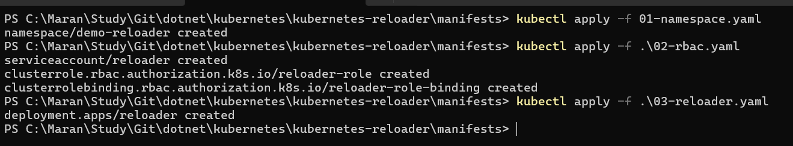

- Check the pods

```bash
kubectl get pods -n demo-reloader
```
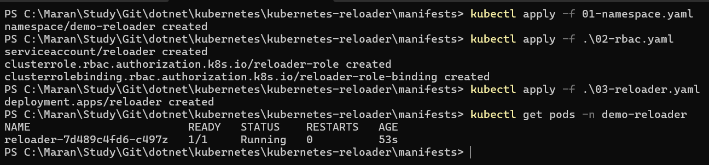

Step 4: Apply Config map and Secrets for our Postgres deployment

```bash
kubectl apply -f .\04-postgres-config.yaml
```

Step 5: Apply the deployment for Postgres
```bash
 kubectl apply -f .\05-postgres-deployment.yaml
```

Step 6: Create and Apply a postgres client which uses the config map's username and database & password from Secrets.
```bash
kubectl apply -f .\06-client.yaml
``` 
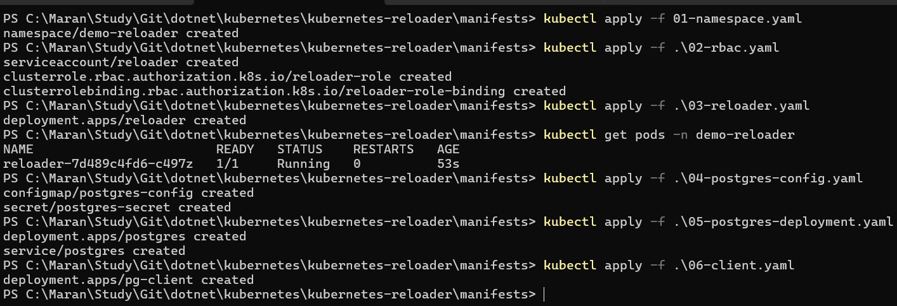

- In the Another Terminal check the logs in the client to verify the successful connection.
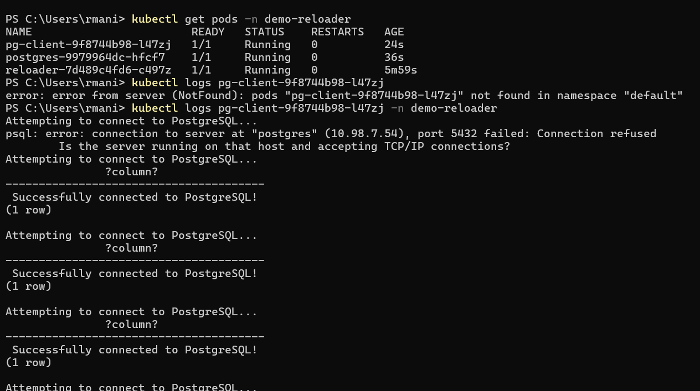

## Keep Watching for Pods

```bash
kubectl get pods -n demo-reloader -w
```

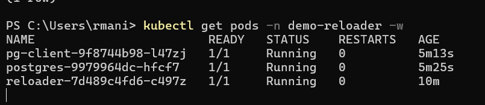

## Now Apply the new Config Update and watch the reloader detects.

```bash
 kubectl apply -f .\07-config-update.yaml
 ``` 

 - Now the reloader deducts and create the new pod as the config file is changed.
 - It also terminate the old pod.

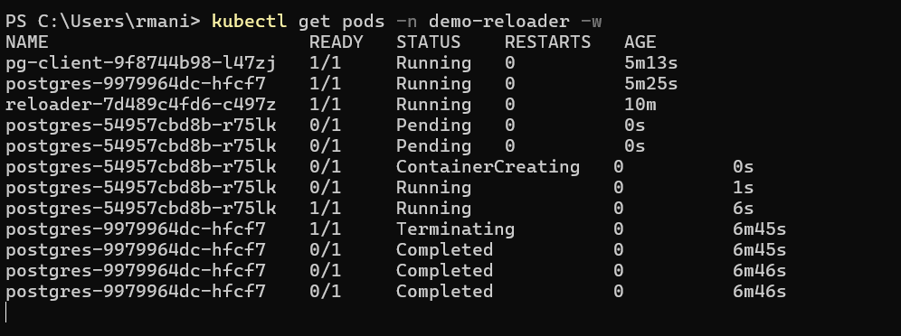

- Now check the logs in the client app pod for connectivity
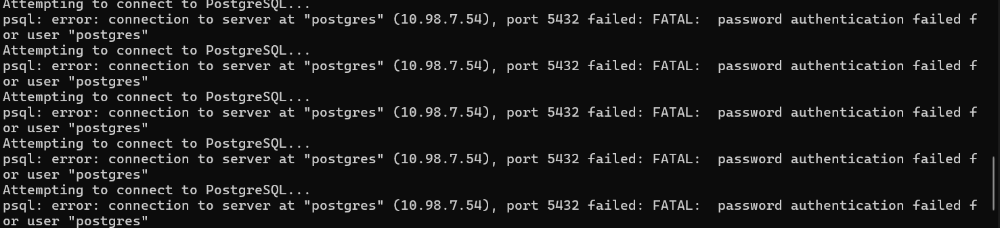


- Now apply the secret-update file using the below command will create new pod and terminate the old pod

```bash
kubectl apply -f ./08-secret-update.yaml
```

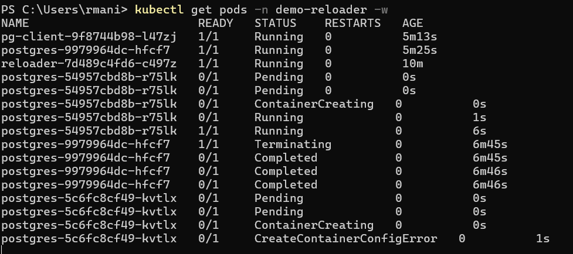


- Now delete the client and recreate to test the connectivity to the database.

```bash
kubectl delete -f 06-client.yaml
```

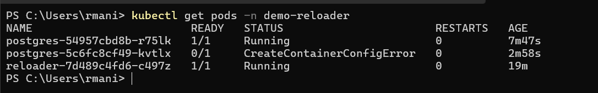

- Now create the client. This will get the new password and username from the config and secrets.

```bash
kubectl apply -f ./06-client.yaml
```

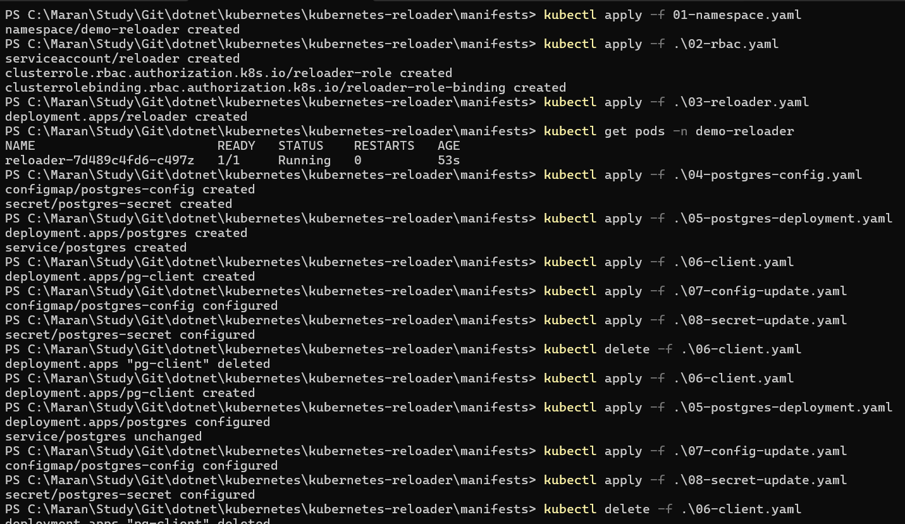

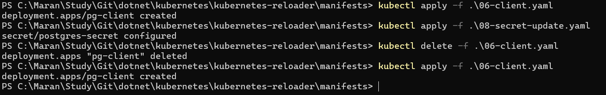

- Check the logs in the postgres client pod

```bash
kubectl get pods -n demo-reloader
# note the Pod Id and apply
kubectl logs -n demo-reloader <podidhere>
```

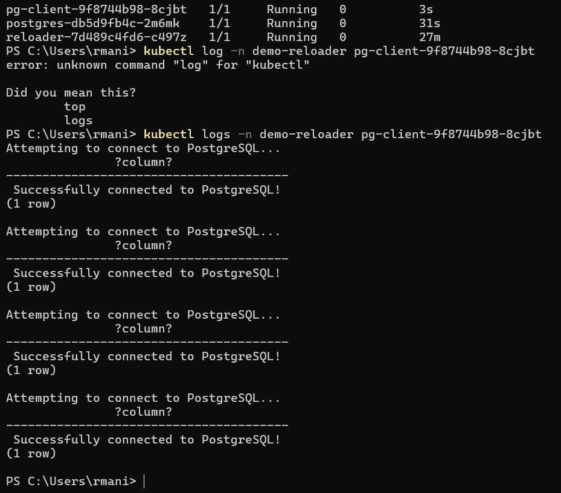

## Headlamp tool view of dashboard

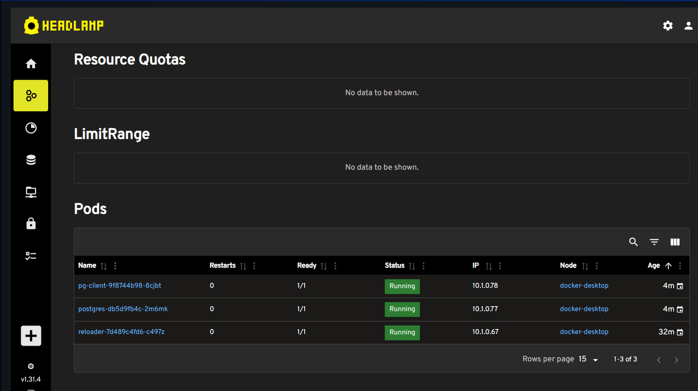

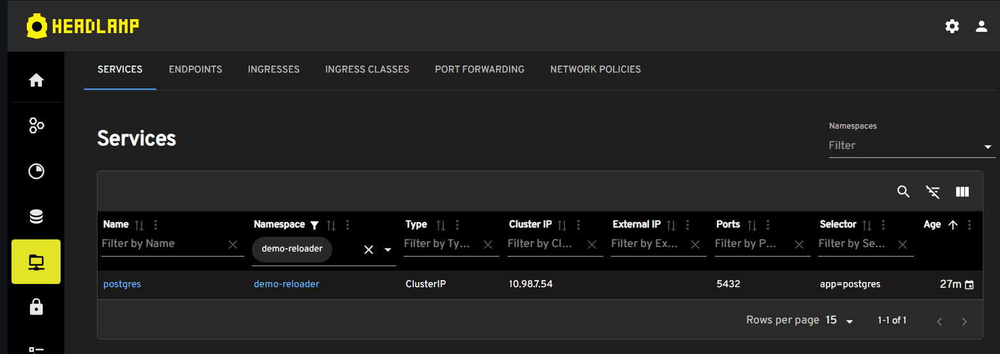

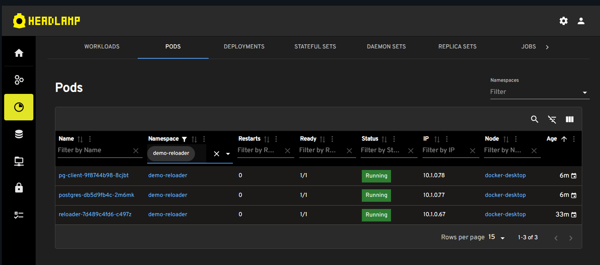

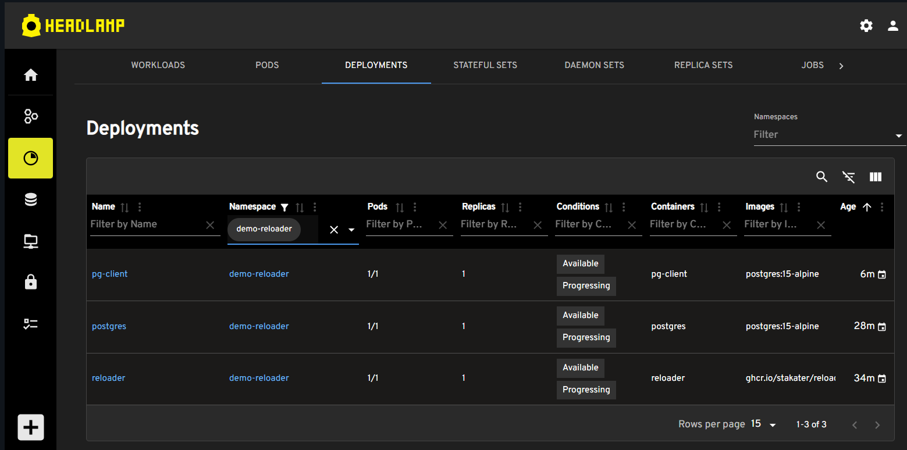

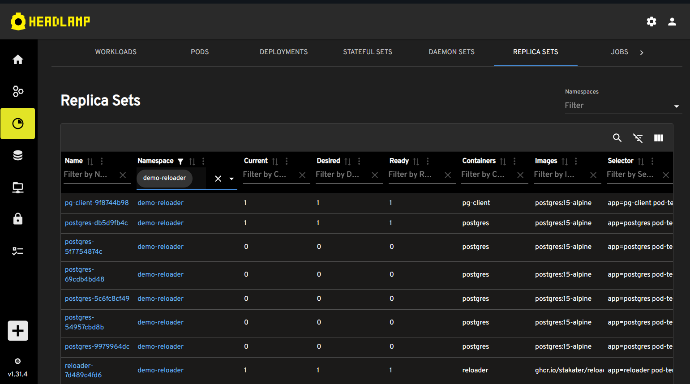

## Deleting the resources created based on the namespace

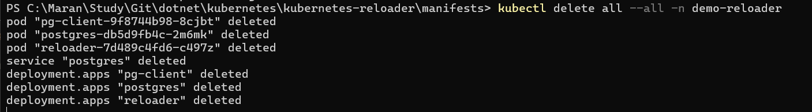